# ***HR Recruitment Agent***

## 🏁 Overview
This repository hosts our team's submission for **Track 2: MCP in Action** in the [MCP's 1st Birthday Hackathon](https://huggingface.co/MCP-1st-Birthday).

Our goal is to build an **autonomous agentic system** that demonstrates:
- **Planning, reasoning, and execution**
- Integration of **custom tools, MCP tools, or external APIs**
- Effective **context engineering**
- Clear, practical **user value**

We'll use **LangGraph** as our orchestration backbone for building multi-turn, tool-using, and context-aware agents.

> ***`Check hackathon README for detilaed requirements.`***

## 🧠 ***`Tools & Frameworks`***

- 🧩 [LangGraph](https://docs.langchain.com/oss/python/langgraph/overview): for multi-agent orchestration and planning
  - Why & how they built [LangGraph for production agents](https://blog.langchain.com/building-langgraph/)
- 🧠 **LLM Engines:** [OpenAI](https://openai.com) / [Anthropic](https://www.anthropic.com) — reasoning and planning models
  - gpt-oss inference providers
    - [Open Router](https://openrouter.ai/openai/gpt-oss-20b):
      - LangChain Wrapper: https://github.com/langchain-ai/langchain/discussions/27964
    - [TogetherAI](https://www.together.ai/openai)
- 💬 [Gradio](https://www.gradio.app/): for the UI and context-engineering demos
- ⚙️ [MCP](https://modelcontextprotocol.io/docs/getting-started/intro) Tools: standardized interfaces for Gmail, Google Calendar, Voice technologies and other APIs
- ☁️ [Google Cloud Platform](https://cloud.google.com): optional backend for hosting MCP servers and integrated services
- 📞 [Twilio](https://www.twilio.com/en-us): enables automated voice calls and candidate interactions
- 🔊 [ElevenLabs](https://elevenlabs.io): (optional) natural text-to-speech for realistic voice screenings
- 🎙️ [Whisper-based Transcription API](https://whisperapi.com) (or [OpenAI Whisper API](https://platform.openai.com/docs/guides/speech-to-text) ) — for speech-to-text functionality in voice interviews
- 🧭 [Langfuse](https://langfuse.com) or [LangSmith](https://docs.langchain.com/langsmith/quick-start-studio): debugging, observability, and trace visualization
- 📄 [Docling](https://www.docling.ai): for parsing and analyzing uploaded CV documents
- 🧱 [Pydantic](https://docs.pydantic.dev/latest/): for structured outputs and data validation
- 🔀 [Parlant](https://github.com/emcie-co/parlant): enables agents to handle multi-intent, free-form conversations by dynamically activating relevant guidelines instead of rigidly routing to a single sub-agent — solving the context fragmentation problem inherent in traditional LangGraph supervisor patterns.

## 📚 ***`References for Context Engineering`***

- [**Context Engineering for AI Agents — Manus Blog**](https://manus.im/blog/Context-Engineering-for-AI-Agents-Lessons-from-Building-Manus)
- [**YouTube Talk Manus**](https://www.youtube.com/watch?v=6_BcCthVvb8&start=2525)
- [**LangGraph Overview**](https://docs.langchain.com/oss/python/langgraph/overview)
- https://www.anthropic.com/engineering/effective-context-engineering-for-ai-agents
- https://medium.com/fundamentals-of-artificial-intelligence/mitigate-context-poisoning-in-ai-agents-using-context-engineering-96cf40dbb38d
- https://blog.langchain.com/context-engineering-for-agents/
- **langgraph implementations**
  - [video]((https://www.youtube.com/watch?v=nyKvyRrpbyY))
  - [good notebooks](https://github.com/langchain-ai/how_to_fix_your_context/blob/main/notebooks/utils.py)
- [Langgraph summary of what frontier labs and firms apply](https://www.youtube.com/watch?v=XFCkrYHHfpQ)

These resources guide our approach to **memory management, planning transparency, and tool orchestration** in autonomous agents.

## 🧾  ***`HR Candidate Screening Multi-Agent System`***
An autonomous HR assistant that streamlines early recruitment through five steps:
1. **CV Upload (Application)** — candidate applications uploaded and parsed
2. **CV Screening** — rank and shortlist candidates using LLM reasoning
3. **Voice Screening** — invite and coordinate interviews using a voice agent.
4. **Person-to-Person Screening** — schedule HR interviews via Google Calendar integration
5. **Decision** — generate a concise summary and notify HR

> **`NOTE`**
> - Final decision of whether candidate will be hired is made by human.
> - Just automate the boring, tedious stuff while keeping human final decision in the loop.

**Architecture:**
1. **Main Planner Agent**: orchestrates the workflow
2. **Subagents**:
  - CV Screening Agent
  - Voice Screening Agent
  - Meeting Scheduler Agent
3. **Tools (via MCP)** connect to Gmail, Calendar, and Voice APIs.
4. **Database** stores both candidate info and persistent agent memory.
5. **Gradio UI** visualizes workflow, reasoning, and results.

```mermaid
flowchart TD
    subgraph MainAgent["🧠 Main Planner Agent"]
        A1["Plans • Reasons • Executes"]
    end

    subgraph Subagents["🤖 Subagents"]
        S1["📄 CV Screening"]
        S2["🎙️ Voice Screening"]
        S3["📅 Scheduling"]
        S4["🧾 Decision Summary"]
    end

    subgraph Tools["⚙️ MCP & External Tools"]
        T1["📧 Gmail"]
        T2["🗓️ Google Calendar"]
        T3["🗣️ Voice API"]
    end

    subgraph Data["🗄️ Database"]
        D1["Candidate Data"]
        D2["Context Memory (Cognitive Offloading)"]
    end

    subgraph UI["💬 Gradio Dashboard"]
        U1["HR View & Interaction"]
    end

    %% Connections
    MainAgent --> Subagents
    Subagents --> Tools
    Subagents --> Data
    MainAgent --> Data
    MainAgent --> UI
```


**GCP Setup for Judges:**
A single demo Gmail/Calendar account (`scionhire.demo@gmail.com`) is pre-authorized via OAuth, with stored credentials in `.env`.
Judges can run or view the live demo without any credential setup, experiencing real Gmail + Calendar automation safely.

We use **hierarchical planning**:
- **Main Agent:** decides next step in the workflow (plan, adapt, replan)
- **Subagents:** specialized executors (screening, scheduling, summarization)
- **Memory State:** tracks plan progress and tool results  
- **Dashboard Visualization:** shows active plan steps and reasoning traces for transparency

🧠 Why This Is an Agent (Not Just a Workflow)

| Criterion | Workflow | Our System |
|------------|-----------|-------------|
| **Autonomy** | Executes fixed sequence of steps | Main agent decides next actions without manual triggers |
| **Planning** | Predefined order (A → B → C) | Main agent generates and adapts a plan (e.g., skip, retry, re-order) |
| **Reasoning** | No decision logic | Uses LLM reasoning to evaluate outputs and choose next subagent |
| **Context Awareness** | Stateless | Maintains shared memory of candidates, progress, and outcomes |
| **Adaptation** | Fails or stops on error | Re-plans (e.g., if calendar slots full or candidate unresponsive) |

✅ **Therefore:** it qualifies as an *agentic system* because it **plans, reasons, and executes** autonomously rather than following a static workflow.

## ***`Project Structure`***
```
agentic-hr/
│
├── 📁 src/
│ │
│ ├── 📁 core/
│ │ │ ├── base_agent.py           # Abstract BaseAgent (LangGraph-compatible)
│ │ │ ├── supervisor.py           # Supervisor agent (LangGraph graph assembly)
│ │ │ ├── state.py                # Shared AgentState + context window
│ │ │ ├── planner.py              # High-level planning logic
│ │ │ └── executor.py             # Graph executor / runner
│ │
│ ├── 📁 agents/
│ │ │
│ │ ├── 📁 cv_screening/
│ │ │ │ ├── agent.py              # CVScreeningAgent implementation
│ │ │ │ ├── 📁 tools/
│ │ │ │ │ ├── doc_parser.py
│ │ │ │ │ ├── normalize_skills.py
│ │ │ │ │ ├── rank_candidates.py
│ │ │ │ │ └── match_to_jd.py
│ │ │ │ └── 📁 schemas/
│ │ │ │     ├── cv_schema.py      # Parsed CV Pydantic schema
│ │ │ │     └── jd_schema.py      # Job description schema
│ │ │
│ │ ├── 📁 voice_screening/
│ │ │ │ ├── agent.py              # VoiceScreeningAgent
│ │ │ │ ├── 📁 tools/
│ │ │ │ │ ├── twilio_client.py
│ │ │ │ │ ├── whisper_transcribe.py
│ │ │ │ │ └── tts_service.py
│ │ │ │ └── 📁 schemas/
│ │ │ │     ├── call_result.py
│ │ │ │     └── transcript.py
│ │ │
│ │ ├── 📁 scheduler/
│ │ │ │ ├── agent.py              # SchedulerAgent
│ │ │ │ ├── 📁 tools/
│ │ │ │ │ ├── calendar_tool.py
│ │ │ │ │ ├── gmail_tool.py
│ │ │ │ │ └── slot_optimizer.py
│ │ │ │ └── 📁 schemas/
│ │ │ │     └── meeting_schema.py
│ │ │
│ │ └── 📁 decision/
│ │     ├── agent.py              # DecisionAgent (final summarizer/Reporter)
│ │     └── 📁 schemas/
│ │         └── decision_report.py
│ │
│ ├── 📁 mcp_server/
│ │   ├── main.py
│ │   ├── 📁 endpoints/
│ │   ├── auth.py
│ │   └── schemas.py
│ │
│ ├── 📁 gradio/
│ │   ├── app.py                  # Main Gradio app (Hugging Face Space entry)
│ │   ├── dashboard.py            # Live agent graph & logs view
│ │   ├── candidate_portal.py     # Candidate upload / screening status
│ │   ├── hr_portal.py            # HR review + interview approval
│ │   ├── components.py           # Shared Gradio components
│ │   └── 📁 assets/              # Logos, CSS, etc.
│ │
│ ├── 📁 cv_ui/
│ │   ├── app.py 
│ │
│ ├── 📁 voice_screening_ui/
│ │   ├── app.py 
│ │
│ │
│ ├── 📁 prompts/
│ │   ├── prompt_manager.py       # Centralized prompt versioning
│ │   ├── cv_prompts.py
│ │   ├── voice_prompts.py
│ │   └── scheduler_prompts.py
│ │
│ ├── 📁 database/
│ │   ├── models.py               # SQLAlchemy models
│ │   ├── db_client.py            # Connection & CRUD
│ │   └── context_sync.py         # Cognitive offloading (context ⇄ DB)
│ │
│ ├── main.py                     # CLI runner / local orchestrator entry
│ └── config.py                   # Environment configuration
│
├── 📁 tests/
│ │ ├── test_cv_agent.py
│ │ ├── test_voice_agent.py
│ │ ├── test_scheduler_agent.py
│ │ ├── test_mcp_server.py
│ │ └── test_integration.py
│
├── .env.example
├── requirements.txt
├── Dockerfile
├── app.py                         # Shortcut to src/ui/app.py
├── README.md
└── LICENSE
```

## ***`Multi Agent System Architecture`***
Below you will find an overview of the subagent components that mnake upo the entire system. More detailed information and brainstorming is decicated to the `docs/agents/..` directory.

### 1) ***`Orchestrator`***
#### Overview

The orchestrator agent is reponsible for **supervising** and **triggering** the ***tasks of the subagents***.

> For more planning and info, go to `docs/agents/agent_orchestrator.md`

### 2) ***`CV Screener`***
#### Overview
The cv screening agent deals with scanning the applicant's CV's, and deciding who are fruitful versus unpromising candidates as a first filtering step.

> For more planning and info, go to `docs/agents/cv_screening.md`

### 3) 🎙️ ***`Voice Screening Agent`***

#### Overview
The **Voice Screening Agent** conducts automated phone interviews and integrates with the **LangGraph HR Orchestrator**.  
It uses **Twilio** for phone calls, **Whisper/ASR** for speech-to-text, **ElevenLabs** for natural voice output, and **LangGraph** for dialogue logic.

> For more planning and info, go to `docs/agents/voice_screening.md`

### 4) ***`Google MCP Agents`***
#### Overview
The google mcp agents will be resposnible to:
a) writing emails
b) scheduling and menaging google calendar events

It adviseable to break this up into two subagents, to get rid of `context poisoning`.

## Overview
This repository hosts our team's submission for **Track 2: MCP in Action** in the [MCP's 1st Birthday Hackathon](https://huggingface.co/MCP-1st-Birthday).

Our project is an autonomous HR recruitment agent that streamlines early-stage candidate screening by automating CV evaluation, voice interviews, and interview scheduling while keeping human decision-makers in the loop. Built on LangGraph for multi-agent orchestration and MCP for standardized tool integration with Gmail, Google Calendar, and Twilio APIs, this system demonstrates practical AI agents that handle real-world HR workflows end-to-end.

### Problem statement
Recruiting early-stage candidates is time-intensive and costly. HR teams spend approximately 40-60% of their screening time on repetitive tasks such as CV review, initial candidate assessments, and scheduling interviews. For companies receiving hundreds of applications per open role, this creates a bottleneck that delays hiring timelines by weeks and increases costs per hire. Additionally, early-stage screening often lacks consistency due to reviewer bias and fatigue, leading to qualified candidates being overlooked and poor cultural fits advancing to expensive in-person interviews.

### Our solution
This system automates the first 80% of the screening pipeline while maintaining human judgment where it matters most. By combining LLM-based CV evaluation, voice-based technical screening, and calendar integration, the agent reduces manual screening time from hours per candidate to minutes, lowering cost-per-hire by an estimated 60-70% while improving consistency and reducing time-to-hire by 2-3 weeks. Rather than replacing human decision-making, it compresses the tedious work into structured data and insights, freeing HR teams to focus on nuanced final decisions and candidate experience.

## How to use it
### Demo
TODO: Explain how to use it, such as through Gradio.

### Candidates
In a real deployment, candidates begin by uploading their CVs through a web portal. The system parses the CV into structured text and automatically evaluates it against the job description using an LLM, scoring skills match, experience alignment, and education fit. Candidates passing the CV screening threshold are invited to a voice screening interview conducted via Twilio, where a conversational agent asks relevant technical and culture-fit questions. The voice call is transcribed and analyzed for communication clarity and sentiment. Qualified candidates are then automatically scheduled for in-person interviews via Google Calendar, with email notifications sent through Gmail MCP integration. Throughout the process, all results (scores, transcripts, reasoning traces) are persisted in a PostgreSQL database, providing HR teams with a dashboard view of each candidate's progression. A final decision agent synthesizes all screening data into a concise report for human HR reviewers to make the ultimate hire/reject/maybe determination.

## How it works
The system is built on a multi-agent orchestration framework using LangGraph, where a main supervisor agent coordinates specialized subagents through the recruitment pipeline. Each agent is a distinct LLM-powered reasoning node that maintains conversation state, invokes tools, accesses external services, and passes context to other agents. This modular design enables each agent to specialize in its domain while the supervisor handles overall workflow planning and adaptation.

The main orchestrator agent serves as the entry point and maintains the overall recruitment workflow. It tracks candidate progress through the pipeline, decides which subagent to activate next, and handles re-planning if any step fails. For example, if no calendar slots are available, the orchestrator can delay scheduling or notify HR rather than simply failing. The CV Screening Agent evaluates candidate CVs against the job description using structured LLM reasoning. It parses uploaded documents using Docling to extract information, scores candidates across multiple dimensions (skills match, experience fit, education alignment, each on a 0-1 scale), and persists results to the database along with reasoning traces for full transparency. The Voice Screening Agent conducts automated phone interviews using Twilio for call management and Whisper for speech-to-text. It engages in multi-turn dialogue asking technical and culture-fit questions, analyzes sentiment and communication quality from transcripts, and generates structured evaluation reports. The Meeting Scheduler Agent integrates with Google Calendar and Gmail through MCP servers to automatically book HR interviews, handling availability checks, calendar conflicts, and email notifications. Finally, the Decision Agent synthesizes all previous evaluations (CV scores, voice transcripts, candidate metadata) into a concise report for human HR reviewers, who retain final authority over hire/reject decisions.

Rather than embedding API credentials and integration logic directly in agent code, the system abstracts external services through MCP (Model Context Protocol) servers. The Gmail MCP server exposes email capabilities like sending interview invitations and confirmations, while the Google Calendar MCP server provides calendar queries and event creation. These servers handle OAuth authentication, rate limiting, and credential management server-side, keeping secrets out of the agent codebase and enabling safe, credential-free demos. Voice operations via Twilio are managed similarly through MCP-compatible interfaces. This abstraction means agents interact with external systems through clean, standardized APIs rather than managing credentials directly, and the same MCP servers can be reused across different projects or agents.

Each agent operates on shared state objects defined using Pydantic to ensure type safety and validation. This state tracks candidate metadata (name, email, CV file path), all screening results (CV scores, voice transcripts, communication ratings), current workflow stage (applied, cv_screened, voice_done, interview_scheduled, decision_made), and tool execution history for debugging. Between agent transitions, the orchestrator updates the shared state with outputs from the previous agent, so the Voice Screening Agent receives CV scores as context, and the Decision Agent has access to all accumulated data. Critically, state is persisted to a PostgreSQL database after each milestone, enabling cognitive offloading so the active LLM context stays uncluttered and information can be retrieved when needed.

The execution flow begins when a candidate uploads a CV through the Streamlit portal. The orchestrator activates the CV Screening Agent, which parses the document and evaluates it against the job description. If the CV score passes the threshold, the orchestrator routes to the Voice Screening Agent, which makes a Twilio call, engages in dialogue, transcribes the conversation, and evaluates communication quality and technical fit. Assuming voice screening succeeds, the orchestrator activates the Meeting Scheduler Agent, which queries Google Calendar via MCP to find available HR slots, books an interview, and sends email confirmations via Gmail MCP. The orchestrator then activates the Decision Agent to prepare a comprehensive summary report. Finally, HR reviews the complete evaluation through the Gradio dashboard and makes the ultimate hire/reject/maybe decision.

Each agent binds tools to its LLM instance so it can call them during reasoning. For example, the Scheduler Agent binds calendar and email tools, allowing it to decide when to create events or send messages. When the LLM generates a tool call, the system executes the tool and returns results to the LLM for further reasoning. All outputs use Pydantic models to ensure consistent, validated formats (e.g., CVScreeningOutput with all evaluation metrics). To maintain transparency and human oversight, all reasoning traces are logged and displayed in the Gradio dashboard, showing current plan state, completed steps, pending actions, reasoning logs from each agent, tool call history with timestamps, and a complete candidate journey with scores and feedback. This visibility satisfies the hackathon's emphasis on context engineering while keeping human decision-makers informed and in control.

## ***Team***
| Member   |
| -------- |
| [Sebastian Wefers](https://github.com/Ocean-code-1995) |
| [Owen Kaplinsky](https://github.com/owenkaplinsky) |
| [SrikarMK](https://github.com/Srikarmk) |
| [Dmitri Moscoglo](https://github.com/DimiM99) |

# ***License***

This project includes and builds upon [gmail-mcp](https://github.com/theposch/gmail-mcp),  
which is licensed under the [GNU General Public License v3.0](https://www.gnu.org/licenses/gpl-3.0.en.html).

This repository extends gmail-mcp for experimental integration and automation with Claude Desktop.  
All modifications are distributed under the same GPLv3 license.