# ***`Recruitment Agent`***
<p align="left">
  
  
  
  
  
  
  
  
  
</p>


> This project was developed as part of the **[MCP 1st Birthday Hackathon](https://huggingface.co/MCP-1st-Birthday)** — submitted under  
> **Track 2: MCP in Action (Enterprise)**, showcasing a real-world multi-agent application built on top of the Model Context Protocol.


<details>
<summary><strong>📚 Table of Contents</strong> (click to expand)</summary>

- [Problem Statement](#problem-statement)
- [Ethical & Regulatory Considerations](#ethical--regulatory-considerations)
- [Quick Start: Run Application](#quick-start-run-application)
  - [Services & Ports](#services--ports)
  - [Infrastructure & Secrets](#infrastructure--secrets)
  - [Run Command](#run-command)
  - [Resetting the Environment](#resetting-the-environment)
- [Application Flow & Entry Points](#application-flow--entry-points)
  - [The Recruitment Lifecycle](#1-the-recruitment-lifecycle)
  - [User Entry Points](#2-user-entry-points)
- [System Architecture](#system-architecture)
- [AI Engineering Principles](#ai-engineering-principles)
  - [Prompt Engineering](#prompt-engineering)
  - [Context Engineering](#context-engineering)
- [Model & Agent Registry](#model--agent-registry)
  - [Integrated MCP Servers](#integrated-mcp-servers)
- [License & Acknowledgments](#license--acknowledgments)
- [Team](#team)

</details>


## **Problem Statement**

Modern recruitment processes remain **slow**, **resource-intensive**, and increasingly **unsustainable** for HR teams amid persistent talent shortages and evolving skill demands. Recent industry reports underscore structural bottlenecks that hinder efficient hiring.

High **applicant volumes overwhelm recruiters**, with a *typical job posting attracting hundreds of applications*, many *unqualified*, leading to administrative burdens and rushed evaluations. This results in *only about **5%** of viewers completing applications*, while teams waste time sifting through low-quality submissions. [`1`]

Screening and early-stage evaluation consume excessive recruiter time, with **35%** of their efforts dedicated to tasks like interview scheduling alone, exacerbating workload pressures. Talent acquisition leaders report unmanageable demands, with **27%** citing overload as a key issue, up from prior years. [`2`]

**Hiring timelines average 44 days across industries**, driven by skills mismatches and manual processes that delay filling critical roles. Globally, **76%** of employers struggle to fill positions due to talent gaps, particularly in tech and healthcare sectors. [`1`, `3`]

The financial toll is significant, with **average cost-per-hire reaching $4,700**, fueled by prolonged cycles, high turnover in recruitment teams (projected at **51%** as a top 2025 challenge), and inefficiencies in sourcing. [`1`, `2`]

HR professionals **face rising burnout** from these pressures, compounded by competition for diverse talent and the **need for more touchpoints in hiring**, which **45%** of leaders say adds complexity. Skills shortages, cited by **63%** of employers as the primary barrier to growth, further strain teams. [`2`, `4`]

These challenges reveal that **traditional manual recruitment fails to scale** in a competitive 2025 landscape. An AI-driven recruitment agent can alleviate bottlenecks by automating screening, accelerating timelines, enhancing consistency, and allowing HR to prioritize strategic decisions over repetitive tasks.


### *`References`*

1. [HR Cloud — 25 Recruitment Challenges & Solutions in 2025](https://www.hrcloud.com/blog/recruitment-challenges)

2. [Select Software Reviews — 100+ Recruitment Statistics Every HR Should Know in 2025](https://www.selectsoftwarereviews.com/blog/recruiting-statistics)

3. [Social Talent — The 2025 Hiring Reality Check](https://www.socialtalent.com/leadership/the-2025-hiring-reality-check-data-driven-answers-to-ta-leaders-top-questions)

4. [World Economic Forum — The Future of Jobs Report 2025](https://www.weforum.org/publications/the-future-of-jobs-report-2025/digest/)

## **Ethical & Regulatory Considerations**

This project was developed as an **experimental prototype for a hackathon**, designed to showcase how language-model agents can automate structured workflows. It is **not intended for production deployment** as an autonomous hiring system. Because it touches on the automated assessment of humans, it must be approached with caution and interpreted within the correct ethical and regulatory context.

The risks of algorithmic profiling have been widely documented, most notably during the **Cambridge Analytica scandal**, where data from millions of users was harvested and used for psychographic targeting without consent. This episode demonstrated how data-driven models can be leveraged to manipulate individuals when used irresponsibly, and it significantly shaped today’s regulatory landscape. [`5`]

Given this history, any system that evaluates or ranks people—particularly in employment—must uphold **strict transparency, human oversight, and narrow scope**. In this prototype, all AI outputs are intended purely as **assistive signals**. The system must **never** be used to autonomously approve, reject, or shortlist candidates.

The **EU AI Act** classifies AI systems used for recruitment, CV screening, candidate ranking, promotion decisions, or termination as **High-Risk AI Systems** (Annex III). Such systems are permitted in the EU but must meet stringent requirements, including:

- **Human oversight** with the ability to override AI suggestions  
- **Transparency** about the model’s role and limitations  
- **Detailed logging and traceability** of system behavior  
- **Bias monitoring and risk management**  
- **High-quality and relevant training data**  
- **Clear separation** between AI scoring and final human judgment

The Act also **prohibits** certain practices in hiring, such as emotion recognition in workplace settings, biometric inference of personality traits, and social-scoring-style ranking systems. [`6`, `7`, `8`]

This prototype **does not** conduct emotion recognition, sensitive-trait inference, biometric profiling, or psychographic prediction. It is a technical experiment focused on agent orchestration, workflow automation, and context management—not an end-to-end HR decision engine.

### **Human-in-the-Loop by Design**
To remain aligned with ethical expectations and regulatory requirements, this system must always operate with:

- **Human-in-the-Loop (HITL):** Recruiters make all decisions.  
- **Explainability:** Agents produce structured rationales, not black-box judgments.  
- **Data minimization:** Only job-relevant information is processed.  
- **No profiling of protected traits:** No biometric, psychographic, or emotional inference.

### **Project Status**
This project remains a **research and demonstration artifact**, created to explore the technical viability of LLM-powered coordination between agents. It highlights what is technologically possible, but is **not a deployable HR solution** under the EU AI Act. Any real-world implementation would require extensive risk assessment, compliance measures, and human oversight to avoid replicating the harms demonstrated in past profiling scandals.

---

### *`References`*

5. [The Guardian — Cambridge Analytica: A Year On, Lesson in Institutional Failure](https://www.theguardian.com/uk-news/2019/mar/17/cambridge-analytica-year-on-lesson-in-institutional-failure-christopher-wylie)

6. [High-level summary of the EU AI Act](https://artificialintelligenceact.eu/high-level-summary/)

7. [EU Digital Strategy — Regulatory Framework for AI](https://digital-strategy.ec.europa.eu/en/policies/regulatory-framework-ai)

8. [Clifford Chance — What Does the EU AI Act Mean for Employers?](https://www.cliffordchance.com/content/dam/cliffordchance/briefings/2024/08/what-does-the-eu-ai-act-mean-for-employers.pdf)


## ***`Quick Start: Run Application`***
To spin up the entire platform including the database, agents, and UI dashboards, we use **Docker Compose**.

### ***Services & Ports***
| Service | Description | Host Port | Container Port |
|---------|-------------|-----------|----------------|
| `db` | PostgreSQL 15 database with persistent storage | **5433** | 5432 |
| `cv_upload_streamlit` | UI for uploading CVs | **8501** | 8501 |
| `voice_screening_streamlit` | UI for voice screening candidates | **8502** | 8501 |
| `supervisor_ui` | Main Chat UI for the Supervisor Agent | **8503** | 8501 |
| `websocket_proxy` | Proxy for OpenAI Realtime API | **8000** | 8000 |

### ***Infrastructure & Secrets***
This project requires Google Cloud credentials for the Gmail and Calendar agents.

- **Secrets:** Google tokens and credentials must be present in the `secrets/` directory.
- **Infrastructure:** You can provision the necessary GCP infrastructure using the code in `terraform/` or the scripts in `scripts/infra/`.
- **Documentation:** For detailed setup instructions, refer to the [MCP Docs](docs/mcp/).

### ***Run Command***
1. **Configure Environment:**
   Copy the example environment file and fill in your API keys:
   ```bash
   cp .env.example .env
   ```

2. **Start Services:**
   ```bash
   docker compose --env-file .env -f docker/docker-compose.yml up --build
   ```

### 🧹 Resetting the Environment
If you need a clean slate (e.g., after modifying DB models):
```bash
# 1. Stop containers
docker compose -f docker/docker-compose.yml down

# 2. Remove persistent DB volume
docker volume rm docker_postgres_data

# 3. Rebuild & Start
docker compose --env-file .env -f docker/docker-compose.yml up --build
```

---

## ***`Application Flow & Entry Points`***

The platform orchestrates a complete recruitment pipeline, interacting with both Candidates and the HR Supervisor.

### 1. The Recruitment Lifecycle
The system tracks candidates through a defined state machine (see `src/backend/state/candidate.py` for the `CandidateStatus` enum).

**Application Flow:** The recruitment process begins when a candidate uploads their CV through the public-facing CV Portal. The HR Manager can then trigger AI-powered CV screening via the chat interface (Supervisor UI), which evaluates the candidate's CV against the job description to assess qualifications, experience, and job fit. Candidates who pass this initial screening receive an invitation to participate in an AI-conducted voice interview via the Voice Portal. The voice interview is then evaluated by an AI judge that assesses communication skills, confidence, and job fit. Successful candidates proceed to a traditional person-to-person interview, where the HR Supervisor makes the final hiring decision. At each stage, candidates may be rejected and notified accordingly. This multi-stage filtering process ensures only the most qualified candidates reach the final interview stage, significantly reducing the administrative burden on HR teams.


### 2. User Entry Points

| User | Interface | Port | Description |
| :--- | :--- | :--- | :--- |
| **HR Manager** | **Supervisor UI** | `8503` | **The Command Center.** Chat with the Supervisor Agent to manage the pipeline, review candidates, query the DB, and schedule interviews. |
| **Candidate** | **CV Portal** | `8501` | Public-facing portal for candidates to register and upload their resumes to the system. |
| **Candidate** | **Voice Portal** | `8502` | AI-conducted voice interview interface. Candidates access this only after passing CV screening and receiving an invite. |

---

## ***`System Architecture`***

The system follows a hierarchical agent architecture where the Supervisor Agent orchestrates specialized sub-agents, which in turn interact with external services through MCP (Model Context Protocol) servers.

```mermaid
graph TD
    %% Entry Point
    HR_Entry[👤 HR Entry Point<br/>Supervisor UI<br/>Port 8503]
    
    %% Supervisor Layer
    Supervisor[🤖 Supervisor Agent<br/>Orchestrator]
    
    %% Sub-Agents Layer
    CV_Screen[📄 CV Screening Agent]
    Voice_Screen[🎤 Voice Screening Agent]
    Gmail_Agent[📧 Gmail Agent]
    GCal_Agent[📅 GCalendar Agent]
    
    %% MCP Servers Layer
    Gmail_MCP[🔌 Gmail MCP Server]
    GCal_MCP[🔌 Calendar MCP Server]
    
    %% External APIs
    Gmail_API[☁️ Google Cloud<br/>Gmail API]
    GCal_API[☁️ Google Cloud<br/>Calendar API]
    
    %% Connections
    HR_Entry -->|User Commands| Supervisor
    
    Supervisor -->|Delegates Tasks| CV_Screen
    Supervisor -->|Delegates Tasks| Voice_Screen
    Supervisor -->|Delegates Tasks| Gmail_Agent
    Supervisor -->|Delegates Tasks| GCal_Agent
    
    Gmail_Agent -->|Uses Tools| Gmail_MCP
    GCal_Agent -->|Uses Tools| GCal_MCP
    
    Gmail_MCP -->|API Calls| Gmail_API
    GCal_MCP -->|API Calls| GCal_API
    
    %% Styling
    style HR_Entry fill:#e3f2fd,stroke:#1565c0,stroke-width:2px
    style Supervisor fill:#e1bee7,stroke:#4a148c,stroke-width:3px
    style CV_Screen fill:#fff3e0,stroke:#ef6c00
    style Voice_Screen fill:#fff3e0,stroke:#ef6c00
    style Gmail_Agent fill:#fff3e0,stroke:#ef6c00
    style GCal_Agent fill:#fff3e0,stroke:#ef6c00
    style Gmail_MCP fill:#c8e6c9,stroke:#2e7d32,stroke-width:2px
    style GCal_MCP fill:#c8e6c9,stroke:#2e7d32,stroke-width:2px
    style Gmail_API fill:#f5f5f5,stroke:#616161,stroke-width:2px
    style GCal_API fill:#f5f5f5,stroke:#616161,stroke-width:2px
```



### **Architecture Layers**

1. **Entry Point Layer:** The HR Supervisor interacts with the system through the Supervisor UI (Gradio interface on port 8503), which serves as the command center for managing the recruitment pipeline.

2. **Orchestration Layer:** The Supervisor Agent receives user commands and orchestrates the workflow by delegating tasks to specialized sub-agents. It maintains conversation context and manages the overall recruitment state.

3. **Sub-Agent Layer:** Specialized agents handle specific domains:
   - **CV Screening Agent:** Evaluates candidate resumes and determines qualification
   - **Voice Screening Agent:** Conducts and evaluates voice interviews
   - **Gmail Agent:** Manages email communications (sending invites, notifications)
   - **GCalendar Agent:** Handles interview scheduling and calendar management

4. **MCP Server Layer:** Model Context Protocol servers provide standardized, secure interfaces between agents and external services:
   - **Gmail MCP Server:** Exposes Gmail operations (list, read, send, label emails)
   - **Calendar MCP Server:** Exposes calendar operations (list, create, update events)

5. **External Services Layer:** Google Cloud APIs provide the underlying infrastructure:
   - **Gmail API:** Handles all email operations
   - **Calendar API:** Manages calendar events and scheduling

This architecture ensures **separation of concerns**, **secure credential management** (MCP servers handle authentication), and **modular extensibility** (new agents or services can be added without modifying the core Supervisor).

---

## ***`AI Engineering Principles`***

### ***Prompt Engineering***

To improve the reliability of complex evaluations (such as CV scoring and Voice Interview judging), we enforce **Chain-of-Thought (CoT)** reasoning within our structured outputs, inspired by [Wei et al. (2022)](https://arxiv.org/abs/2201.11903).

By requiring the model to generate a textual explanation *before* assigning numerical scores, we ensure the model "thinks" through the evidence before committing to a decision. This is implemented directly in our Pydantic schemas (e.g., `src/backend/agents/cv_screening/schemas/output_schema.py`), where field order matters:


This simple structural constraint leads to significantly better calibration and reduced hallucination in scoring.

### ***Context Engineering***

To ensure long-running reliability and precision, this system employs a multi-layered approach to context management. This architecture prevents **"Context Rot"**—a phenomenon where LLM performance degrades as input length increases, as highlighted in [Chroma's research](https://research.trychroma.com/context-rot). By managing context effectively, we ensure agents remain focused and accurate over extended interactions.


#### 1. Context Isolation via Delegation
Instead of a single monolithic agent, tasks are delegated to **specialized sub-agents** (e.g., `cv_screener`, `voice_screener`).

- **Delegate (Solid Arrow):** The Supervisor initiates a task, passing only the necessary context to a specific sub-agent.
- **Report Back (Dotted Arrow):** Once the sub-agent completes its task, it returns a structured summary to the Supervisor, ensuring the main context remains clean.

```mermaid
graph TD
    %% Legend (Top)
    subgraph Legend [Legend]
        direction LR
        KeySup[Supervisor] -->|Delegation| KeyAgent[Sub-Agent]
        KeyAgent -.->|Report Back| KeySup
    end

    %% Force Legend to be above Supervisor
    Legend ~~~ Supervisor

    Supervisor[🤖 Supervisor Agent]

    %% Sub-Agents
    Gmail[📧 Gmail Agent]
    Cal[📅 GCalendar Agent]
    DBExec[💾 DB Executor]
    CV[📄 CV Screener]
    Voice[🎤 Voice Screener]

    %% Delegation (Outbound)
    Supervisor --> Gmail
    Supervisor --> Cal
    Supervisor --> DBExec
    Supervisor --> CV
    Supervisor --> Voice

    %% Feedback (Inbound)
    Gmail -.-> Supervisor
    Cal -.-> Supervisor
    DBExec -.-> Supervisor
    CV -.-> Supervisor
    Voice -.-> Supervisor

    %% Styling
    style Supervisor fill:#e1bee7,stroke:#4a148c,stroke-width:2px
    style Gmail fill:#fff3e0,stroke:#e65100
    style Cal fill:#fff3e0,stroke:#e65100
    style DBExec fill:#fff3e0,stroke:#e65100
    style CV fill:#e3f2fd,stroke:#1565c0
    style Voice fill:#e3f2fd,stroke:#1565c0
    style Legend fill:#f5f5f5,stroke:#9e9e9e,stroke-dasharray: 5 5
```



- **How it works:** Each *sub-agent* operates in its *own isolated context/thread*.
- **Benefit:** The main Supervisor is not polluted with low-level execution logs. Sub-agents are **stateless** from the Supervisor's perspective—each trigger starts a fresh thread, preventing error accumulation in the workers.


#### 2. Context Offloading & Loading (RAG-lite)
We treat the database not just as storage, but as **offloaded context**.
- **Offloading:** Candidate data, screening results, and interview states are persisted immediately to a structured SQL/JSON database.
- **Loading:** The Supervisor does not keep all candidate data in memory. Instead, it utilizes the `db_executor` agent to **retrieve (load)** only the specific data points needed for the current planning step.
- **Benefit:** Keeps the active context window lean and focused on *reasoning* rather than *storage*.

#### 3. Adaptive Context Compaction
For the **stateful Supervisor** (which manages the long-running user conversation), we implement **Compactive Summarization**.
- **Mechanism:** As the conversation history exceeds a token threshold, older interactions are summarized into a concise narrative while recent messages are kept verbatim.
- **Result:** The agent retains "long-term memory" of the conversation arc without hitting context window limits, keeping the Supervisor "forever young."


## ***`Model & Agent Registry`***

A breakdown of the various LLMs, Agents, and Workflows powering the system.

- 🤖 **Agent:** Autonomous entity that can use tools, plan multiple steps, and maintain reasoning loops.
- ⚙️ **Workflow:** Deterministic, fixed sequence of operations (Pipeline). It may use LLMs for specific steps but the flow is hardcoded.
- 🧠 **Simple LLM:** A direct "one-shot" call to a Language Model for a specific transformation (e.g., summarization, extraction) without tools or loops.

| Component | Type | Model | Description | Location |
| :--- | :--- | :--- | :--- | :--- |
| **Supervisor Agent** | 🤖 **Agent** | `gpt-4o` | Orchestrates delegation, planning, and context management. | `src/backend/agents/supervisor/supervisor_v2.py` |
| **Gmail Agent** | 🤖 **Agent** | `gpt-4o` | Autonomous email management via MCP (read/send/label). | `src/backend/agents/gmail/gmail_agent.py` |
| **GCalendar Agent** | 🤖 **Agent** | `gpt-4o` | Autonomous calendar scheduling via MCP. | `src/backend/agents/gcalendar/gcalendar_agent.py` |
| **DB Executor** | 🤖 **Agent** | `gpt-4o` | Writes SQL/Python to query the database (CodeAct). | `src/backend/agents/db_executor/db_executor.py` |
| **CV Screening** | ⚙️ **Workflow** | `gpt-4o` | Deterministic pipeline: Fetch → Read → Evaluate → Save. | `src/backend/agents/cv_screening/cv_screening_workflow.py` |
| **Voice Judge** | 🧠 **Simple LLM** | `gpt-4o-audio` | Evaluates audio/transcripts for sentiment & confidence. | `src/backend/agents/voice_screening/judge.py` |
| **Doc Parser** | 🧠 **Simple LLM** | `gpt-4o-mini` | Vision-based PDF-to-Markdown conversion. | `src/backend/doc_parser/pdf_to_markdown.py` |
| **History Manager** | 🧠 **Simple LLM** | `gpt-4o-mini` | Summarizes conversation history for context compaction. | `src/backend/context_eng/history_manager.py` |

### 🔌 ***`Integrated MCP Servers`***
The system integrates **Model Context Protocol (MCP)** servers to securely and standardizedly connect agents to external tools.

| MCP Server | Purpose | Used By |
| :--- | :--- | :--- |
| **Gmail MCP** | Provides tools to `list`, `read`, `send`, and `label` emails. | `Gmail Agent` |
| **Google Calendar MCP** | Provides tools to `list_events`, `create_event`, and `update_event`. | `GCalendar Agent` |

> **Note:** Each MCP server runs as a standalone process that exposes a standardized tool interface, which the respective agent consumes dynamically.

---

## ***`License & Acknowledgments`***
This project utilizes code from:
- [gmail-mcp](https://github.com/theposch/gmail-mcp) by **theposch** (GPLv3)  
  *Integrated at:* `src/mcp_servers/gmail-mcp/`
- [calendar-mcp](https://github.com/deciduus/calendar-mcp) by **deciduus** (AGPL-3.0)  
  *Integrated at:* `src/mcp_servers/calendar-mcp/`

We deeply acknowledge these original works and the great AI and Data Science community that makes such collaboration possible. We distribute our modifications under the compatible license terms.

---

## 👥 ***`Team`***
| Member   |
| -------- |
| [Sebastian Wefers](https://github.com/Ocean-code-1995) |
| [Dmitri Moscoglo](https://github.com/DimiM99) |
| [Owen Kaplinsky](https://github.com/owenkaplinsky) |
| [SrikarMK](https://github.com/Srikarmk) |
