# ***`Recruitment Agent`***

  
  
  
  
  
  
  
  
  

> This project was developed as part of the **[MCP 1st Birthday Hackathon](https://huggingface.co/MCP-1st-Birthday)** — submitted under  
> **Track 2: MCP in Action (Enterprise)**, showcasing a real-world multi-agent application built on top of the Model Context Protocol.

<strong>📚 Table of Contents</strong> (click to expand)

- [Problem Statement](#problem-statement)
- [Ethical & Regulatory Considerations](#ethical--regulatory-considerations)
- [Quick Start: Run Application](#quick-start-run-application)
  - [Services & Ports](#services--ports)
  - [Infrastructure & Secrets](#infrastructure--secrets)
  - [Run Command](#run-command)
  - [Resetting the Environment](#resetting-the-environment)
- [Application Flow & Entry Points](#application-flow--entry-points)
  - [The Recruitment Lifecycle](#1-the-recruitment-lifecycle)
  - [User Entry Points](#2-user-entry-points)
- [AI Engineering Principles](#ai-engineering-principles)
  - [Prompt Engineering](#prompt-engineering)
  - [Context Engineering](#context-engineering)
- [Model & Agent Registry](#model--agent-registry)
  - [Integrated MCP Servers](#integrated-mcp-servers)
- [License & Acknowledgments](#license--acknowledgments)
- [Team](#team)

## **Problem Statement**

Modern recruitment is buckling under high volumes and inefficiency, creating a critical bottleneck for organizational growth.

*   **Overwhelmed Teams**: **35%** of recruiter time is lost to admin tasks like scheduling [`2`], with **27%** of leaders citing workload overload [`2`].
*   **Slow & Expensive**: Average time-to-hire is **44 days** [`1`], with costs reaching **$4,700 per hire** [`1`].
*   **Inefficient Funnel**: While job posts attract hundreds of applicants, only **5%** complete the process [`1`], and **76%** of employers still struggle to find the right talent [`3`].
*   **Burnout Risk**: **51%** of HR teams face high turnover risks [`2`], driven by the inability to scale manual screening against rising application volumes.

This agentic system automates high-volume screening tasks, allowing HR professionals to focus on strategic decision-making.

### *`References`*

1. [HR Cloud — 25 Recruitment Challenges & Solutions in 2025](https://www.hrcloud.com/blog/recruitment-challenges)

2. [Select Software Reviews — 100+ Recruitment Statistics Every HR Should Know in 2025](https://www.selectsoftwarereviews.com/blog/recruiting-statistics)

3. [Social Talent — The 2025 Hiring Reality Check](https://www.socialtalent.com/leadership/the-2025-hiring-reality-check-data-driven-answers-to-ta-leaders-top-questions)

4. [World Economic Forum — The Future of Jobs Report 2025](https://www.weforum.org/publications/the-future-of-jobs-report-2025/digest/)

## **Ethical & Regulatory Considerations**

This project is an **experimental prototype** designed to demonstrate technical orchestration of LLM agents, **not a production-ready HR system**.

*   **Human-in-the-Loop (HITL)**: The system is purely assistive. All final decisions (approvals/rejections) must be made by human recruiters.
*   **EU AI Act Compliance**: Recruitment AI is classified as **High-Risk**. This prototype addresses key requirements via:
    *   **Transparency**: Clear logs of agent reasoning.
    *   **Oversight**: No autonomous final judgments.
    *   **Prohibited Practices**: No emotion recognition, biometric inference, or psychographic profiling.
*   **Scope**: Limited to workflow automation and initial screening support. It does not replace human judgment.

---

### *`References`*

5. [The Guardian — Cambridge Analytica: A Year On, Lesson in Institutional Failure](https://www.theguardian.com/uk-news/2019/mar/17/cambridge-analytica-year-on-lesson-in-institutional-failure-christopher-wylie)

6. [High-level summary of the EU AI Act](https://artificialintelligenceact.eu/high-level-summary/)

7. [EU Digital Strategy — Regulatory Framework for AI](https://digital-strategy.ec.europa.eu/en/policies/regulatory-framework-ai)

8. [Clifford Chance — What Does the EU AI Act Mean for Employers?](https://www.cliffordchance.com/content/dam/cliffordchance/briefings/2024/08/what-does-the-eu-ai-act-mean-for-employers.pdf)

## **System Architecture**

1. **User Interfaces (Gradio)**: Serves both **HR Managers** (Supervisor Chat & Management) and **Candidates** (CV Upload & Voice Interface).
2. **Supervisor Agent**: The main planner that orchestrates the process by delegating to:
   - **DB Executor**: Handles data queries/updates via code execution.
   - **CV & Voice Screeners**: Specialized agents for assessment.
   - **Gmail & Calendar Agents**: Manage communication and scheduling.
3. **MCP Servers**: Connect the Gmail and Calendar agents to external Google APIs.
4. **Database**: Central storage for candidate profiles and recruitment state.

## ***`Application Flow & Entry Points`***

The platform orchestrates a complete recruitment pipeline, interacting with both Candidates and the HR Supervisor.

### 1. The Recruitment Lifecycle

The candidate application flow follows these key stages:

1. **Application Submission**: Candidate applies; status set to `applied`.
2. **CV Screening**: AI analyzes CV (`cv_screened`) and evaluates it (`cv_passed` or `cv_rejected`).
3. **Voice Invitation**: Qualified candidates receive an email with an auth code for the AI voice interview (`voice_invitation_sent`).
4. **Voice Screening**: Candidate completes the AI interview (`voice_done`); AI judge evaluates performance (`voice_passed` or `voice_rejected`).
5. **Human Interview Scheduling**: Successful candidates are offered available time slots for a person-to-person interview based on HR calendar availability.
6. **Confirmation**: Interview is scheduled (`interview_scheduled`) upon candidate's response.
7. **Final Decision**: HR makes a decision (`hired` or `rejected`), and the outcome is communicated to the candidate. 

### 2. User Entry Points

| User | Interface | Description |
| :--- | :--- | :--- |
| **HR Manager** | **Supervisor UI** | **The Command Center.** Chat with the Supervisor Agent to manage the pipeline, review candidates, query the DB, and schedule interviews. |
| **Candidate** | **CV Portal** | Public-facing portal for candidates to register and upload their resumes to the system. |
| **Candidate** | **Voice Portal** | AI-conducted voice interview interface. Candidates access this only after passing CV screening and receiving an invite. |

The interaction between these entry points and the agentic workflow is visualized in the state machine below:

---

## ***`AI Engineering Principles`***

### ***Prompt Engineering***

To improve the reliability of complex evaluations (such as CV scoring and Voice Interview judging), we enforce **Chain-of-Thought (CoT)** reasoning within our structured outputs, inspired by [Wei et al. (2022)](https://arxiv.org/abs/2201.11903).

By requiring the model to generate a textual explanation *before* assigning numerical scores, we ensure the model "thinks" through the evidence before committing to a decision. This is implemented directly in our Pydantic schemas (e.g., `src/agents/cv_screening/schemas/output_schema.py`), where field order matters:

This simple structural constraint leads to significantly better calibration and reduced hallucination in scoring.

### ***Context Engineering***

To ensure long-running reliability and precision, this system employs a multi-layered approach to context management. This architecture prevents **"Context Rot"**—a phenomenon where LLM performance degrades as input length increases, as highlighted in [Chroma's research](https://research.trychroma.com/context-rot). By managing context effectively, we ensure agents remain focused and accurate over extended interactions.

#### 1. Context Isolation via Delegation
Instead of a single monolithic agent, tasks are delegated to **specialized sub-agents** (e.g., `cv_screener`, `voice_screener`).

- **Delegate (Solid Arrow):** The Supervisor initiates a task, passing only the necessary context to a specific sub-agent.
- **Report Back (Dotted Arrow):** Once the sub-agent completes its task, it returns a structured summary to the Supervisor, ensuring the main context remains clean.

```mermaid
graph TD
    %% Legend (Top)
    subgraph Legend [Legend]
        direction LR
        KeySup[Supervisor] -->|Delegation| KeyAgent[Sub-Agent]
        KeyAgent -.->|Report Back| KeySup
    end

    %% Force Legend to be above Supervisor
    Legend ~~~ Supervisor

    Supervisor[🤖 Supervisor Agent]

    %% Sub-Agents
    Gmail[📧 Gmail Agent]
    Cal[📅 GCalendar Agent]
    DBExec[💾 DB Executor]
    CV[📄 CV Screener]
    Voice[🎤 Voice Screener]

    %% Delegation (Outbound)
    Supervisor --> Gmail
    Supervisor --> Cal
    Supervisor --> DBExec
    Supervisor --> CV
    Supervisor --> Voice

    %% Feedback (Inbound)
    Gmail -.-> Supervisor
    Cal -.-> Supervisor
    DBExec -.-> Supervisor
    CV -.-> Supervisor
    Voice -.-> Supervisor

    %% Styling
    style Supervisor fill:#e1bee7,stroke:#4a148c,stroke-width:2px
    style Gmail fill:#fff3e0,stroke:#e65100
    style Cal fill:#fff3e0,stroke:#e65100
    style DBExec fill:#fff3e0,stroke:#e65100
    style CV fill:#e3f2fd,stroke:#1565c0
    style Voice fill:#e3f2fd,stroke:#1565c0
    style Legend fill:#f5f5f5,stroke:#9e9e9e,stroke-dasharray: 5 5
```

- **How it works:** Each *sub-agent* operates in its *own isolated context/thread*.
- **Benefit:** The main Supervisor is not polluted with low-level execution logs. Sub-agents are **stateless** from the Supervisor's perspective—each trigger starts a fresh thread, preventing error accumulation in the workers.

#### 2. Context Offloading & Loading (RAG-lite)
We treat the database not just as storage, but as **offloaded context**.
- **Offloading:** Candidate data, screening results, and interview states are persisted immediately to a structured SQL/JSON database.
- **Loading:** The Supervisor does not keep all candidate data in memory. Instead, it utilizes the `db_executor` agent to **retrieve (load)** only the specific data points needed for the current planning step.
- **Benefit:** Keeps the active context window lean and focused on *reasoning* rather than *storage*.

#### 3. Adaptive Context Compaction
For the **stateful Supervisor** (which manages the long-running user conversation), we implement **Compactive Summarization**.
- **Mechanism:** As the conversation history exceeds a token threshold, older interactions are summarized into a concise narrative while recent messages are kept verbatim.
- **Result:** The agent retains "long-term memory" of the conversation arc without hitting context window limits, keeping the Supervisor "forever young."

## ***`Model & Agent Registry`***

A breakdown of the various LLMs, Agents, and Workflows powering the system.

- 🤖 **Agent:** Autonomous entity that can use tools, plan multiple steps, and maintain reasoning loops.
- ⚙️ **Workflow:** Deterministic, fixed sequence of operations (Pipeline). It may use LLMs for specific steps but the flow is hardcoded.
- 🧠 **Simple LLM:** A direct "one-shot" call to a Language Model for a specific transformation (e.g., summarization, extraction) without tools or loops.

| Component | Type | Model | Description | Location |
| :--- | :--- | :--- | :--- | :--- |
| **Supervisor Agent** | 🤖 **Agent** | `gpt-4o` | Orchestrates delegation, planning, and context management. | `src/agents/supervisor/supervisor_v2.py` |
| **Gmail Agent** | 🤖 **Agent** | `gpt-4o` | Autonomous email management via MCP (read/send/label). | `src/agents/gmail/gmail_agent.py` |
| **GCalendar Agent** | 🤖 **Agent** | `gpt-4o` | Autonomous calendar scheduling via MCP. | `src/agents/gcalendar/gcalendar_agent.py` |
| **DB Executor** | 🤖 **Agent** | `gpt-4o` | Writes SQL/Python to query the database (CodeAct). | `src/agents/db_executor/db_executor.py` |
| **CV Screening** | ⚙️ **Workflow** | `gpt-4o` | Deterministic pipeline: Fetch → Read → Evaluate → Save. | `src/agents/cv_screening/cv_screening_workflow.py` |
| **Voice Judge** | 🧠 **Simple LLM** | `gpt-4o-audio` | Evaluates audio/transcripts for sentiment & confidence. | `src/agents/voice_screening/judge.py` |
| **Doc Parser** | 🧠 **Simple LLM** | `gpt-4o-mini` | Vision-based PDF-to-Markdown conversion. | `src/doc_parser/pdf_to_markdown.py` |
| **History Manager** | 🧠 **Simple LLM** | `gpt-4o-mini` | Summarizes conversation history for context compaction. | `src/context_eng/history_manager.py` |

### 🔌 ***`Integrated MCP Servers`***
The system integrates **Model Context Protocol (MCP)** servers to securely and standardizedly connect agents to external tools.

| MCP Server | Purpose | Used By |
| :--- | :--- | :--- |
| **Gmail MCP** | Provides tools to `list`, `read`, `send`, and `label` emails. | `Gmail Agent` |
| **Google Calendar MCP** | Provides tools to `list_events`, `create_event`, and `update_event`. | `GCalendar Agent` |

> **Note:** Each MCP server runs as a standalone process that exposes a standardized tool interface, which the respective agent consumes dynamically.

---

## ***`License & Acknowledgments`***
This project utilizes code from:
- [gmail-mcp](https://github.com/theposch/gmail-mcp) by **theposch** (GPLv3)  
  *Integrated at:* `src/mcp_servers/gmail-mcp/`
- [calendar-mcp](https://github.com/deciduus/calendar-mcp) by **deciduus** (AGPL-3.0)  
  *Integrated at:* `src/mcp_servers/calendar-mcp/`

We deeply acknowledge these original works and the great AI and Data Science community that makes such collaboration possible. We distribute our modifications under the compatible license terms.

---

## 👥 ***`Team`***
| Member   |
| -------- |
| [Sebastian Wefers](https://github.com/Ocean-code-1995) |
| [Dmitri Moscoglo](https://github.com/DimiM99) |
| [Owen Kaplinsky](https://github.com/owenkaplinsky) |
| [SrikarMK](https://github.com/Srikarmk) |
