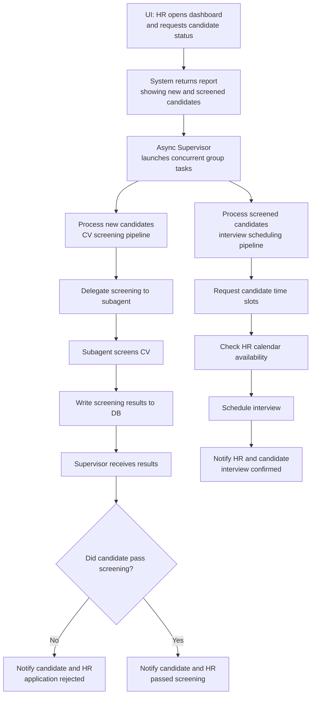

# ***MVP version #1***
---


## HR-Triggered Autonomous Workflow Concept

The system is designed to operate **autonomously** while still allowing HR to initiate workflows and request status insights.  
This ensures maximum automation without losing control or clarity in the process.

---

### **HR Interaction Trigger**

When HR opens the UI, they can interact with the supervisor agent by asking questions such as:

> **“Hey recruitment agent, what is the current status quo? Any new applicants? How many have passed CV screening?”**

The supervisor agent then:

1. Queries the database using predefined tools  
2. Generates a clear, human-friendly status report  
3. Waits for HR instructions on how to proceed  

HR can then issue high-level commands like:

- **“Process all new applicants.”**  
- **“Do not process new applicants further — notify them instead.”**  
- **“Continue processing only applicants who already passed screening.”**

---

### **Supervisor Executes Fully Autonomous Actions**

Once HR gives the high-level command, the supervisor performs all actions autonomously:

- **Process new applicants**  
  - Parse CVs  
  - Run CV screening  
  - Update DB  
  - Notify or proceed depending on results  

- **Process screened applicants further**  
  - Notify candidate  
  - Request available time slots  
  - Match HR availability  
  - Schedule interview  
  - Send confirmation emails  

---

### **Concurrency and Isolation**

To avoid mixing contexts across candidates:

- **Only one supervisor agent instance runs at a time**
- Supervisor processes candidates **sequentially**
- Each candidate is handled **individually and deterministically**

This avoids:
- Context bleed  
- Duplicate actions  
- Race conditions  
- Mixed reasoning across candidates  

---

### **Per-Candidate Deterministic State Machine**

Each candidate has a small state object:

```json
{
  "candidate_id": 123,
  "state": "cv_uploaded",
  "checklist_path": "users/123/checklist.md"
}
```
This keeps the workflow predictable, restartable, and isolated.

---

### ***Per-Candidate Checklist File***
Each candidate has a personal Markdown checklist:
```text
# Candidate Checklist — ID 123

- [x] CV uploaded
- [x] CV parsed and stored
- [x] CV screening started
- [x] CV screening completed
- [ ] Screening results notified to candidate
- [ ] Asked candidate for available time slots
- [ ] Received candidate availability
- [ ] Checked HR availability
- [ ] Scheduled interview
- [ ] Final confirmation email sent
```
The supervisor uses this checklist to determine the next atomic action.
It loads only this candidate’s context, performs exactly one update, writes back, and moves on.

---
## **Hybrid Progress Tracking — DB Status + Checklist**

The HR agent maintains two synchronized layers of workflow state:

- **Database `status` field:**  
  Captures the **coarse-grained milestone** in the candidate’s lifecycle  
  (e.g., `applied`, `cv_screened`, `interview_scheduled`, `decision_made`).  
  → This is the **authoritative system state** used for HR dashboards, analytics, and reporting.

- **Per-candidate Markdown checklist:**  
  Tracks **fine-grained atomic actions** that occur within each milestone  
  (e.g., CV parsed, CV screened, email sent, candidate replied).  
  → This serves as the **agent’s operational log**, enabling deterministic reasoning, auditing, and safe restarts.

---

### **Checklist and Milestone Boundaries**

The **checklist** is composed of multiple **substeps**, each representing one small, deterministic action.  
When all substeps belonging to a stage are completed, the system reaches a **milestone boundary**.  
That boundary marks a safe point to update the candidate’s `status` field in the database.

| Milestone (`status` in DB) | Meaning | Checklist Substeps Leading to Boundary |
|-----------------------------|----------|---------------------------------------|
| `applied` | Candidate record created | `[x] CV uploaded`, `[x] CV parsed` |
| `cv_screened` | Screening phase finished | `[x] Screening started`, `[x] Screening completed`, `[x] Result stored` |
| `interview_scheduled` | Interview arranged | `[x] Candidate notified`, `[x] Availability received`, `[x] Interview scheduled` |
| `decision_made` | Final decision delivered | `[x] Interview completed`, `[x] Decision logged`, `[x] Notification email sent` |

---

### **Sync Rule**

1. After **each atomic substep**, the supervisor updates the checklist file.  
2. When a **milestone boundary** is reached (all substeps for a phase checked off),  
   the supervisor updates the corresponding `status` field in the database.  
3. The checklist remains the **fine-grained operational truth**,  
   while the database holds the **coarse-grained canonical truth**.

---

### **Summary**

- **Checklist = micro-level progress tracker** (agent reasoning + recovery)  
- **Milestone boundaries = transition triggers** (define when to sync with DB)  
- **Database `status` = macro-level lifecycle state** (system-wide reference)

This hybrid approach combines **LLM-friendly transparency** with **system-level consistency**, ensuring the agent can reason, recover, and scale safely.


---

### ***Result***
This approach provides:
- High autonomy
- Strong safety boundaries
- No context mixing
- Clear state tracking
- Reliable execution
- HR keeps high-level control
- LLM handles reasoning, routing, and next steps autonomously
This structure is scalable, maintainable, and production-friendly while still pushing agent autonomy very far.


## ⚡ Handling Everything Concurrently — The Async Supervisor Layer



To support concurrent processing across groups and candidates, the supervisor now operates as an asynchronous orchestrator.
It remains a single agent context — responsible for reasoning, reporting, and orchestration — but leverages asyncio to execute multiple workflows concurrently.
This allows the system to:
- Process multiple groups (e.g., new vs. screened candidates) in parallel
- Process multiple candidates per group concurrently
- Maintain isolation and determinism per candidate through separate state/checklist files

---

Conceptual Overview
1. HR issues a high-level command (e.g., “Process all candidates”).
2. The supervisor queries the database and identifies candidate groups.
3. It launches async tasks for each group simultaneously.
4. Within each group, candidates are processed concurrently — each running the deterministic checklist logic described above.
5. The supervisor awaits completion of all group tasks and reports progress and results.

This preserves:
✅ Single supervisor reasoning context
✅ Concurrent group + per-candidate execution
✅ Isolated per-candidate state and file I/O
✅ High throughput without context bleed

---

***Conceptual Async Code Example***

```python
import asyncio
from typing import List

# --- Candidate-level deterministic flow ---
async def process_candidate(candidate):
    """Execute the per-candidate checklist and state transitions."""
    state = await load_candidate_state(candidate.id)

    if state == "cv_uploaded":
        await parse_and_screen_cv(candidate)
    elif state == "screened":
        await schedule_interview(candidate)
    # ... additional states here

    await save_candidate_state(candidate.id, state)
    print(f"✅ Candidate {candidate.id} processed ({state})")


# --- Group-level concurrent handler ---
async def process_group(candidates: List, group_name: str):
    """Handle all candidates in one group concurrently."""
    print(f"⚙️ Processing group: {group_name} ({len(candidates)} candidates)")
    tasks = [process_candidate(c) for c in candidates]
    await asyncio.gather(*tasks)
    print(f"✅ Group {group_name} completed")


# --- Main supervisor orchestration ---
async def supervisor_run():
    """Supervisor orchestrates all concurrent candidate workflows."""
    print("🧠 Supervisor initialized")

    # Query database and classify candidates
    report = await get_candidate_report()
    new_candidates = report["new"]
    screened_candidates = report["screened"]

    # Launch group workflows concurrently
    await asyncio.gather(
        process_group(new_candidates, "new_candidates"),
        process_group(screened_candidates, "screened_candidates")
    )

    print("🎯 All candidate groups processed successfully")


# --- Entry point ---
if __name__ == "__main__":
    asyncio.run(supervisor_run())
```

---
***Key Properties***
- **Async orchestration, single agent:** The supervisor coordinates all tasks without duplicating reasoning contexts.
- **Per-candidate determinism:** Each checklist/state file is loaded, updated, and written atomically.
- **Parallel group execution:** New and screened candidates can be processed simultaneously.
- **Scalability path:** The same async structure can later integrate with LangGraph’s parallel nodes or distributed queues.