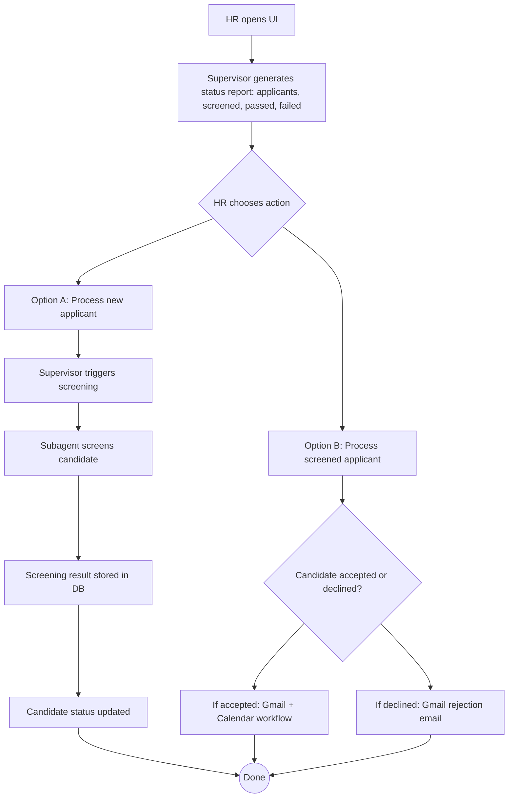

# ***Single-Candidate MVP — Tick Box Milestones***
---

This V1 map outlines the simplest complete workflow for the HR agent system: HR enters the UI, receives a clear overview of all candidates and their screening status, and then chooses one of two actions—process new applicants or continue with those who are already screened. The supervisor then carries out the chosen workflow step-by-step, invoking the appropriate subagents (screening, Gmail, calendar) and updating each candidate’s state accordingly.


## **V1 Workflow Diagram — HR → Supervisor → Actions**


# Single-Candidate MVP — General Tick Box Milestones 

## **1) CV Upload + Candidate Storage**
- [ ] Candidate record created in DB (manual trigger OK)
- [ ] CV file uploaded (manual OK for MVP)
- [ ] CV parsed into structured format
- [ ] Parsed CV stored in DB linked to candidate
- [ ] Candidate status set to `uploaded`

---

## **2) Supervisor + Basic UI (Single Entry Point)**

### **2.1 HR Status Query & Reporting**
- [ ] Supervisor responds to: “What is the current status quo?”
- [ ] Supervisor reports total number of applicants
- [ ] Supervisor reports how many have been screened
- [ ] Supervisor reports how many passed vs failed screening
- [ ] Supervisor presents results as a clear HR-friendly summary report

### **2.2 Supervisor Actions**
- [ ] “Process new applicant” option available
- [ ] “Process screened applicant” option available

### **2.3 Action Logic**
- [ ] Choosing “process new applicant” triggers initial screening workflow
- [ ] Choosing “process screened applicant” triggers:
  - [ ] Gmail + calendar workflow for accepted candidates
  - [ ] Gmail rejection workflow for declined candidates

### **2.4 State Updates**
- [ ] Supervisor updates candidate status after each action
- [ ] Supervisor logs each action outcome into DB

---

## **3) CV Screening Subagent**
- [ ] Subagent loads candidate record
- [ ] Subagent loads stored CV text
- [ ] Subagent performs CV screening
- [ ] Structured screening result saved to DB
- [ ] Candidate status updated to `screened`
- [ ] Supervisor UI reflects updated screening status

---

## **4) Per-Candidate Deterministic State Machine**
- [ ] Each candidate has a dedicated state object (e.g., `state: "cv_uploaded"`)
- [ ] State object persisted in DB or file
- [ ] Supervisor reads this state before taking actions
- [ ] Supervisor updates the state after actions
- [ ] Workflow remains predictable and restartable per candidate
- [ ] Each candidate’s context is isolated (no cross-candidate bleed)

---

## **5) Per-Candidate Checklist File**
- [ ] A Markdown checklist file is created per candidate
- [ ] Checklist is updated at each atomic step
- [ ] Supervisor loads checklist to determine next required action
- [ ] Checklist mirrors real workflow steps (upload → screening → notification → scheduling)
- [ ] Checklist allows deterministic progress tracking
- [ ] Checklist helps ensure one atomic action per supervisor step


---


# 🧭 Incremental Implementation Roadmap — From Skeleton to MVP

This roadmap breaks the HR Agent MVP into incremental, testable phases.  
Each phase builds on the previous one — keeping the system functional at every step while increasing autonomy, determinism, and traceability.

A key invariant across all phases:
> 🧩 **Each atomic action must update the per-candidate Markdown checklist**  
> The checklist is the single source of truth for progress, state recovery, and auditability.

***Checklist:***
```text
# Candidate Checklist — ID 123

- [ ] CV uploaded
- [ ] CV parsed and stored
- [ ] CV screening started
- [ ] CV screening completed
- [ ] Screening results notified to candidate & HR
- [ ] Asked candidate for available time slots
- [ ] Received candidate availability
- [ ] Checked HR availability
- [ ] Scheduled interview
- [ ] Final confirmation email sent
```
---

## **Phase 1 — Foundation Layer: Candidate I/O + Static State**

Goal: Establish basic data persistence and candidate representation.  
Outcome: You can manually create a candidate, attach a CV, and store structured data.

- [ ] DB schema or JSON store for candidates  
  - `candidate_id`, `name`, `cv_path`, `state`, `screening_result`
- [ ] Manual script or simple UI form to create a candidate  
- [ ] Upload CV file (manual or API endpoint)
- [ ] Parse CV into structured format
- [ ] Store parsed CV in DB
- [ ] Candidate state set to `"cv_uploaded"`
- [ ] ✅ **Checklist updated after each atomic step:**
  - `[x] CV uploaded`
  - `[x] CV parsed`
  - `[x] Candidate stored`

---

## **Phase 2 — Supervisor Core Logic (CLI or Barebones UI)**

Goal: Implement the supervisor agent’s reasoning + reporting loop for one candidate.  
Outcome: HR can ask status questions and issue simple actions.

- [ ] Simple command interface or Streamlit-like dashboard  
- [ ] Supervisor responds to: “What’s the current status quo?”  
- [ ] Supervisor reports:
  - [ ] Total number of applicants  
  - [ ] Number screened  
  - [ ] Number passed vs failed  
- [ ] HR can issue commands:
  - [ ] `process_new_applicant`
  - [ ] `process_screened_applicant`
- [ ] Supervisor executes one step → updates candidate state  
- [ ] State transitions logged  
- [ ] ✅ **Checklist updated automatically after each supervisor action**

---

## **Phase 3 — Screening Subagent Integration**

Goal: Automate CV evaluation and store results.  
Outcome: Supervisor delegates screening to subagent and records outcome.

- [ ] Subagent loads candidate record + parsed CV  
- [ ] Runs screening model (mock or real)  
- [ ] Produces structured result (e.g., `{passed: True, score: 85}`)  
- [ ] Saves result in DB  
- [ ] Candidate state transitions:
  - `"cv_uploaded"` → `"screened_passed"` or `"screened_failed"`
- [ ] Supervisor report reflects updated screening counts  
- [ ] ✅ **Checklist updated:**
  - `[x] Screening started`
  - `[x] Screening completed`
  - `[x] Result stored`

---

## **Phase 4 — Candidate Communication Layer (Gmail Integration)**

Goal: Automate candidate notifications based on screening results.  
Outcome: Supervisor triggers Gmail subagent to send emails.

- [ ] Gmail subagent setup  
- [ ] For `screened_failed`: send rejection email  
- [ ] For `screened_passed`: send congratulations + request time slots  
- [ ] Email status stored in DB  
- [ ] Candidate state transitions:
  - `"screened_failed"` → `"notified_rejection"`  
  - `"screened_passed"` → `"awaiting_time_slots"`
- [ ] ✅ **Checklist updated:**
  - `[x] Candidate notified of result`
  - `[x] Email status recorded`

---

## **Phase 5 — Interview Scheduling Layer (Calendar Integration)**

Goal: Automate scheduling for passed candidates.  
Outcome: Supervisor matches availability and books meetings.

- [ ] Calendar subagent setup  
- [ ] Candidate time slot parsing (from email reply or mock)  
- [ ] Check HR calendar availability  
- [ ] Schedule meeting and send confirmation email  
- [ ] Candidate state transitions:
  - `"awaiting_time_slots"` → `"interview_scheduled"`
- [ ] ✅ **Checklist updated:**
  - `[x] Candidate provided time slots`
  - `[x] HR availability checked`
  - `[x] Interview scheduled`
  - `[x] Confirmation sent`

---

# Advanced System Features - Future Directions for Next MVP

## **Phase 6 — Determinism + Persistence Layer**

Goal: Make the system predictable, restartable, and auditable.  
Outcome: Each candidate runs in isolation with explicit state and checklist.

- [ ] Per-candidate state object stored in DB or JSON  
- [ ] Per-candidate Markdown checklist file created:


## **Phase 7 — Async Supervisor Orchestration (Scaling Up)**

Goal: Extend single-candidate flow to multiple candidates concurrently.  
Outcome: Async orchestration across candidate groups.

- [ ] Async supervisor runs concurrently across groups:
  - [ ] New candidates → screening path  
  - [ ] Screened candidates → scheduling path  
- [ ] Each candidate processed in an isolated coroutine  
- [ ] Checklist + state ensure deterministic behavior per candidate  
- [ ] Supervisor reports real-time progress  
- [ ] Single reasoning context preserved  
- [ ] ✅ **Each candidate’s checklist still governs progression, ensuring isolation and safe concurrency**
- [ ] Supervisor awaits all async tasks and compiles final HR summary report  
- [ ] System supports safe restarts (resume from last known checklist state)  
- [ ] Scalable to LangGraph or distributed queue orchestration later on

This roadmap breaks the HR Agent MVP into incremental, testable phases.
Each phase builds logically on the previous one — so the system remains functional at every step while increasing in autonomy and complexity.

---
