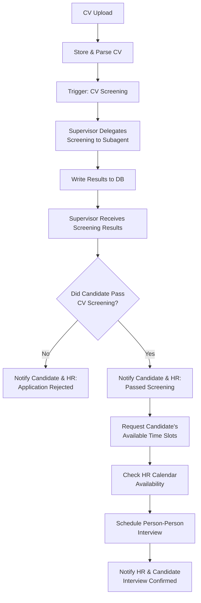

# **Application Flow**

## **MVP Version #2**

The first goal is to ensure the application flows and works autonomously as follows:

### **1) CV Submission**
- Applicant submits CV  
- CV is parsed and stored  

### **2) CV Screening**
- Supervisor agent becomes aware that a CV was uploaded  
- A **“CV was uploaded” signal** triggers the supervisor to delegate **CV screening** to a sub-agent  
- Results are written to the database & candidate status is updated  
- A **“CV was screened” signal** notifies the supervisor that results are available and is able to read the results from db

### **3) Success / Failure Notification**

Based on CV screening results that the supervisor injected into its context, it decides:

#### **a) Not Passed**
- Trigger sub-agent to notify candidate *and* HR via email that the candidate did not meet requirements

#### **b) Passed**
- Trigger sub-agent to:
  - Notify candidate and HR of the successful CV screening
  - Ask candidate to provide several available time slots
  - Check HR’s available time slots in their calendar
  - Schedule a meeting based on overlapping availability  
  - Notify HR that candidate X passed CV screening and that an interview was scheduled on **`dd-mm-yyyy`**

## **Final**
*(To be defined)*  
