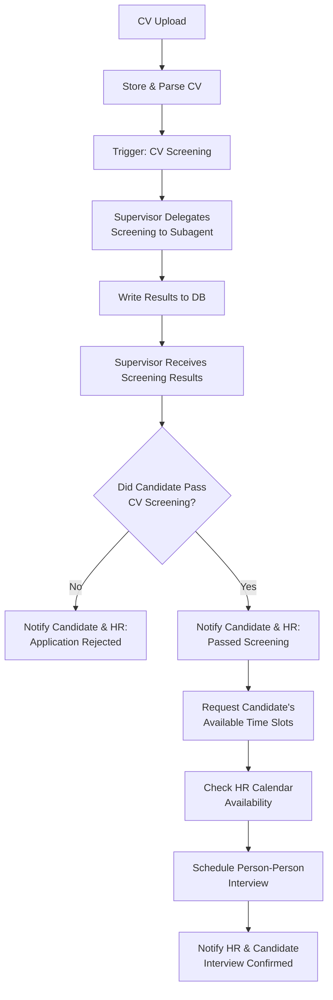

# **Application Flow**

## **MVP Version #2**

The first goal is to ensure the application flows and works autonomously as follows:

### **1) CV Submission**
- Applicant submits CV  
- CV is parsed and stored  

### **2) CV Screening**
- Supervisor agent becomes aware that a CV was uploaded  
- A **“CV was uploaded” signal** triggers the supervisor to delegate **CV screening** to a sub-agent  
- Results are written to the database & candidate status is updated  
- A **“CV was screened” signal** notifies the supervisor that results are available and is able to read the results from db

### **3) Success / Failure Notification**

Based on CV screening results that the supervisor injected into its context, it decides:

#### **a) Not Passed**
- Trigger sub-agent to notify candidate *and* HR via email that the candidate did not meet requirements

#### **b) Passed**
- Trigger sub-agent to:
  - Notify candidate and HR of the successful CV screening
  - Ask candidate to provide several available time slots
  - Check HR’s available time slots in their calendar
  - Schedule a meeting based on overlapping availability  
  - Notify HR that candidate X passed CV screening and that an interview was scheduled on **`dd-mm-yyyy`**

### MVP Development Milestones

| Status | Milestone | Description | Expected Output |
|--------|-----------|-------------|-----------------|
| [ ] | **M1 — CV Upload Pipeline** | Set up CV upload endpoint (UI or API), parse CV text, extract candidate email (if present), and store in DB. | CV successfully stored; DB entry created. |
| [ ] | **M2 — Event Trigger: `cv_uploaded`** | Implement event or signal that notifies the supervisor agent that a new CV has been uploaded. | Supervisor receives `cv_uploaded` event and wakes up. |
| [ ] | **M3 — Supervisor Delegates Screening** | Supervisor calls `screen_cv` tool with CV text + job description + email. | Subagent screens the CV and returns structured results. |
| [ ] | **M4 — Save Screening Results** | Store screening output in DB and update candidate status. Ensure supervisor receives `cv_screened` signal. | Results visible in DB; candidate status updated. |
| [ ] | **M5 — Decision Logic (PASS / FAIL)** | Supervisor reads results, applies thresholding rules, and decides outcome. | Supervisor outputs PASS/FAIL decision with reasoning. |
| [ ] | **M6 — Notify HR & Candidate (Failure Path)** | Implement subagent that sends email templates for rejection and logs communication. | Candidate & HR receive failure notification email. |
| [ ] | **M7 — Notify HR & Candidate (Success Path)** | Implement success notification; request available time slots from candidate. | Candidate & HR receive success email; availability request sent. |
| [ ] | **M8 — Collect Candidate Availability** | Store time slots provided by candidate; validate formatting. | Candidate availability saved in DB. |
| [ ] | **M9 — Check HR Calendar Availability** | Implement calendar integration: read HR time slots, find overlaps with candidate. | HR availability loaded; intersects computed. |
| [ ] | **M10 — Schedule Person-Person Interview** | Select optimal time; schedule in HR calendar; update candidate status to `interview_scheduled`. | Calendar event created; DB updated with interview details. |
| [ ] | **M11 — Final Notifications** | Notify HR and candidate of scheduled interview with exact date/time. | Both parties receive confirmation email. |
| [ ] | **M12 — End-to-End Test (Full Flow)** | Run full automated pipeline from CV upload → interview scheduled. | Entire process runs autonomously without manual steps. |

---

## **Final**
*(To be defined)*  
