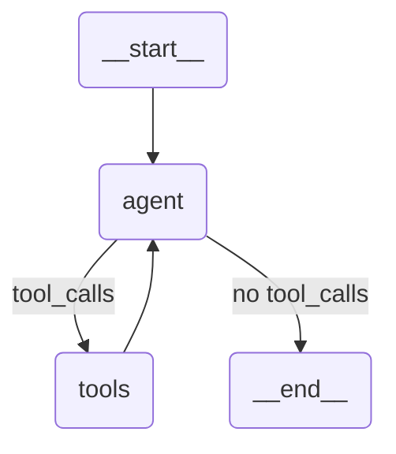

# 🧭 LangGraph Overview: Message Flow, Tool Execution & GPT-OSS Integration
LangGraph is a workflow engine for building agentic systems on top of LangChain.
It models the reasoning–action loop between models and tools using a transparent graph of nodes.

This document explains:
1. How LangGraph message flow works
2. How tools and tool calls are represented
3. How your custom GPT-OSS (OpenRouter) wrapper integrates via bind_tools()

---

## ⚙️ Core Concept
LangGraph passes a `state` object between nodes, usually defined like this:
```python
from typing import Annotated, List, TypedDict, Any
from langgraph.graph.message import add_messages

class State(TypedDict):
    messages: Annotated[List[Any], add_messages]
```

The `messages` list holds the entire conversation: user inputs, model responses, and tool outputs.
Each node reads this list, adds new messages, and returns an updated state.

**LangGraph uses LangChain message objects:**
- 🧑‍💼 HumanMessage — from the user
- 🤖 AIMessage — from the model (may include tool_calls)
- 🧰 ToolMessage — from a tool
- ⚙️ SystemMessage — optional context

## 🧩 The Typical Agent Flow
```sql
HumanMessage ─► LLMNode ─► ToolNode ─► LLMNode ─► Final Answer
```

### 1️⃣ Human input
```python
input_state = {
    "messages": [
        HumanMessage(
            content="Compute 8 * 12 using calculator tool"
        )
    ]
}
```
LangGraph starts from `START` and passes this to the first node (the model).

### 2️⃣ Model response: tool call
Your model (`ChatOpenRouter` running GPT-OSS) examines the conversation and returns an `AIMessage`:
```json
{
  "content": "",
  "tool_calls": [
    {
      "id": "call_1",
      "function": {"name": "calculator", "arguments": "{\"a\":8,\"b\":12,\"op\":\"mul\"}"}
    }
  ],
  "finish_reason": "tool_calls"
}
```
✅ LangGraph detects `.tool_calls` and automatically routes the next step to the ToolNode.

### 3️⃣ Tool execution
The ***ToolNode*** executes the requested tool and adds a `ToolMessage` to the state:
```python
ToolMessage(
    content='96.0',
    name='calculator',
    tool_call_id='call_1'
)
```

### 4️⃣ LLM continuation
The LLM now sees:
```
[
  HumanMessage(...),
  AIMessage(..., tool_calls=[...]),
  ToolMessage(name="calculator", content="96.0")
]
```

It generates a final summary message:
```text
"The result of 8 × 12 is **96**."
```
Since this new message has no further `tool_calls`, LangGraph ends the workflow.

## 🧠 Internal Message Logic
| Step | Message Type   | Produced By | Purpose             |
| ---- | -------------- | ----------- | ------------------- |
| 1    | `HumanMessage` | user        | Input               |
| 2    | `AIMessage`    | model       | Requests tool       |
| 3    | `ToolMessage`  | ToolNode    | Returns tool output |
| 4    | `AIMessage`    | model       | Final answer        |


LangGraph uses conditional edges to decide whether to continue looping:
```python
workflow.add_conditional_edges(
    "agent",
    lambda state: "tools" if state["messages"][-1].tool_calls else END
)
```
This keeps running until no more tool calls are made.

## ⚙️ Example Graph Definition
```python
from langgraph.graph import StateGraph, START, END
from langgraph.prebuilt import ToolNode
from langchain_core.messages import HumanMessage
from langchain_core.tools import tool
from src.core.llm_providers.openrouter_llm import ChatOpenRouter

@tool
def calculator(a: float, b: float, op: str) -> float:
    """Perform a basic arithmetic operation."""
    if op == "add": return a + b
    if op == "sub": return a - b
    if op == "mul": return a * b
    if op == "div": return a / b

tools = [calculator]

# Initialize GPT-OSS LLM
llm = ChatOpenRouter(model_name="openai/gpt-oss-120b", temperature=0.0)

# ✅ Bind tools — this injects tool schemas into the model's context
llm_with_tools = llm.bind_tools(tools)

def call_model(state: State) -> State:
    response = llm_with_tools.invoke(state["messages"])
    return {"messages": [response]}

workflow = StateGraph(State)
workflow.add_node("agent", call_model)
workflow.add_node("tools", ToolNode(tools))
workflow.add_edge(START, "agent")
workflow.add_conditional_edges(
    "agent", lambda s: "tools" if s["messages"][-1].tool_calls else END
)
workflow.add_edge("tools", "agent")

agent = workflow.compile()
input_state = {"messages": [HumanMessage(content="Compute 8 * 12 using calculator tool")]}
print(agent.invoke(input_state))
```

***>>> Check `notebooks/playground.ipynb` to see it in action!***



## 🧩 How bind_tools() Works Internally
`bind_tools()` is the bridge between LangGraph and your LLM.
When you call:

```python
llm_with_tools = llm.bind_tools(tools)
```

LangChain:
1. Extracts each tool's name, description, and argument schema.
2. Converts them into an OpenAI function-calling schema JSON block (like `tools=[{"type":"function","function":{"name":...}}]`).
3. Attaches that schema to the model's context before each inference call.
So GPT-OSS sees an augmented prompt like this:
> “You have access to the following tools:
> calculator(a: float, b: float, op: str) — Perform a basic arithmetic operation.”


During inference, the model can reason (internally) about which tool to call and output structured JSON like:
```json
{
  "tool_calls": [{
    "function": {
      "name": "calculator",
      "arguments": "{\"a\":8,\"b\":12,\"op\":\"mul\"}"
    }
  }]
}
```


---

## 🧱 GPT-OSS Integration via ChatOpenRouter
To connect GPT-OSS via OpenRouter, use your wrapper:
```python
# src/core/llm_providers/openrouter_llm.py
from langchain_openai import ChatOpenAI
from pydantic_settings import BaseSettings, SettingsConfigDict

class OpenRouterSettings(BaseSettings):
    OPENROUTER_API_KEY: str
    model_config = SettingsConfigDict(env_file=".env", extra="ignore")

class ChatOpenRouter(ChatOpenAI):
    """OpenRouter wrapper for GPT-OSS and other open models."""

    def __init__(
        self,
        model_name: str = "openai/gpt-oss-120b",
        base_url: str = "https://openrouter.ai/api/v1",
        temperature: float = 0.2,
        **kwargs,
    ):
        settings = OpenRouterSettings()
        super().__init__(
            model_name=model_name,
            openai_api_base=base_url,
            openai_api_key=settings.OPENROUTER_API_KEY,
            temperature=temperature,
            **kwargs,
        )
```
Then simply:
```python
llm = ChatOpenRouter()
llm_with_tools = llm.bind_tools(tools)
```
✅ This passes your validated API key to the OpenRouter endpoint.

✅ bind_tools() adds your tool schemas to the model input so GPT-OSS knows which functions exist.

✅ LangGraph handles execution and looping automatically.


---

## 🔁 Full Flow Recap

| Step | Component              | What Happens                                               |
| ---- | ---------------------- | ---------------------------------------------------------- |
| 1    | `ChatOpenRouter`       | Sends messages to GPT-OSS via OpenRouter API               |
| 2    | `bind_tools()`         | Injects tool schema into model context                     |
| 3    | `AIMessage.tool_calls` | Model outputs structured tool call                         |
| 4    | `ToolNode`             | Executes the requested function                            |
| 5    | `ToolMessage`          | Returns tool result to model                               |
| 6    | `AIMessage`            | Model produces natural-language final answer               |
| ✅    | LangGraph              | Orchestrates routing and maintains full conversation state |


## ✅ TL;DR
- LangGraph represents an agent loop as a message-passing graph.
- Messages include `HumanMessage`, `AIMessage`, and `ToolMessage`.
- `bind_tools()` injects your tool schemas into the LLM's context so it can call them.
- The ToolNode executes the functions and feeds results back into the loop.
- Your `ChatOpenRouter` wrapper lets GPT-OSS models participate in this system seamlessly.

