# ***`Gradio Agents & MCP Hackathon Winter Edition 2025`***

## 🏁 Overview
This repository hosts our team's submission for **Track 2: MCP in Action** in the [MCP's 1st Birthday Hackathon](https://huggingface.co/MCP-1st-Birthday).

Our goal is to build an **autonomous agentic system** that demonstrates:
- **Planning, reasoning, and execution**
- Integration of **custom tools, MCP tools, or external APIs**
- Effective **context engineering**
- Clear, practical **user value**

We'll use **LangGraph** as our orchestration backbone for building multi-turn, tool-using, and context-aware agents.

> ***`Check hackathon README for detilaed requirements.`***

## 🧠 ***`Tools & Frameworks`***

- 🧩 [LangGraph](https://docs.langchain.com/oss/python/langgraph/overview): for multi-agent orchestration and planning
  - Why & how they built [LangGraph for production agents](https://blog.langchain.com/building-langgraph/)
- 🧠 **LLM Engines:** [OpenAI](https://openai.com) / [Anthropic](https://www.anthropic.com) — reasoning and planning models
  - gpt-oss inference providers
    - [Open Router](https://openrouter.ai/openai/gpt-oss-20b):
      - LangChain Wrapper: https://github.com/langchain-ai/langchain/discussions/27964
    - [TogetherAI](https://www.together.ai/openai)
- 💬 [Gradio](https://www.gradio.app/): for the UI and context-engineering demos
- ⚙️ [MCP](https://modelcontextprotocol.io/docs/getting-started/intro) Tools: standardized interfaces for Gmail, Google Calendar, Voice technologies and other APIs
- ☁️ [Google Cloud Platform](https://cloud.google.com): optional backend for hosting MCP servers and integrated services
- 📞 [Twilio](https://www.twilio.com/en-us): enables automated voice calls and candidate interactions
- 🔊 [ElevenLabs](https://elevenlabs.io): (optional) natural text-to-speech for realistic voice screenings
- 🎙️ [Whisper-based Transcription API](https://whisperapi.com) (or [OpenAI Whisper API](https://platform.openai.com/docs/guides/speech-to-text) ) — for speech-to-text functionality in voice interviews
- 🧭 [Langfuse](https://langfuse.com) or [LangSmith](https://docs.langchain.com/langsmith/quick-start-studio): debugging, observability, and trace visualization
- 📄 [Docling](https://www.docling.ai): for parsing and analyzing uploaded CV documents
- 🧱 [Pydantic](https://docs.pydantic.dev/latest/): for structured outputs and data validation
- 🔀 [Parlant](https://github.com/emcie-co/parlant): enables agents to handle multi-intent, free-form conversations by dynamically activating relevant guidelines instead of rigidly routing to a single sub-agent — solving the context fragmentation problem inherent in traditional LangGraph supervisor patterns.

## 📚 ***`References for Context Engineering`***

- [**Context Engineering for AI Agents — Manus Blog**](https://manus.im/blog/Context-Engineering-for-AI-Agents-Lessons-from-Building-Manus)
- [**YouTube Talk Manus**](https://www.youtube.com/watch?v=6_BcCthVvb8&start=2525)
- [**LangGraph Overview**](https://docs.langchain.com/oss/python/langgraph/overview)
- https://www.anthropic.com/engineering/effective-context-engineering-for-ai-agents
- https://medium.com/fundamentals-of-artificial-intelligence/mitigate-context-poisoning-in-ai-agents-using-context-engineering-96cf40dbb38d
- https://blog.langchain.com/context-engineering-for-agents/
- **langgraph implementations**
  - [video]((https://www.youtube.com/watch?v=nyKvyRrpbyY))
  - [good notebooks](https://github.com/langchain-ai/how_to_fix_your_context/blob/main/notebooks/utils.py)
- [Langgraph summary of what frontier labs and firms apply](https://www.youtube.com/watch?v=XFCkrYHHfpQ)

These resources guide our approach to **memory management, planning transparency, and tool orchestration** in autonomous agents.

## 🧾  ***`HR Candidate Screening Multi-Agent System`***
An autonomous HR assistant that streamlines early recruitment through five steps:
1. **CV Upload (Application)** — candidate applications uploaded and parsed
2. **CV Screening** — rank and shortlist candidates using LLM reasoning
3. **Voice Screening** — invite and coordinate interviews using a voice agent.
4. **Person-to-Person Screening** — schedule HR interviews via Google Calendar integration
5. **Decision** — generate a concise summary and notify HR

> **`NOTE`**
> - Final decision of whether candidate will be hired is made by human.
> - Just automate the boring, tedious stuff while keeping human final decision in the loop.

**Architecture:**
1. **Main Planner Agent**: orchestrates the workflow
2. **Subagents**:
  - CV Screening Agent
  - Voice Screening Agent
  - Meeting Scheduler Agent
3. **Tools (via MCP)** connect to Gmail, Calendar, and Voice APIs.
4. **Database** stores both candidate info and persistent agent memory.
5. **Gradio UI** visualizes workflow, reasoning, and results.

```mermaid
flowchart TD
    subgraph MainAgent["🧠 Main Planner Agent"]
        A1["Plans • Reasons • Executes"]
    end

    subgraph Subagents["🤖 Subagents"]
        S1["📄 CV Screening"]
        S2["🎙️ Voice Screening"]
        S3["📅 Scheduling"]
        S4["🧾 Decision Summary"]
    end

    subgraph Tools["⚙️ MCP & External Tools"]
        T1["📧 Gmail"]
        T2["🗓️ Google Calendar"]
        T3["🗣️ Voice API"]
    end

    subgraph Data["🗄️ Database"]
        D1["Candidate Data"]
        D2["Context Memory (Cognitive Offloading)"]
    end

    subgraph UI["💬 Gradio Dashboard"]
        U1["HR View & Interaction"]
    end

    %% Connections
    MainAgent --> Subagents
    Subagents --> Tools
    Subagents --> Data
    MainAgent --> Data
    MainAgent --> UI
```


**GCP Setup for Judges:**
A single demo Gmail/Calendar account (`scionhire.demo@gmail.com`) is pre-authorized via OAuth, with stored credentials in `.env`.
Judges can run or view the live demo without any credential setup, experiencing real Gmail + Calendar automation safely.

We use **hierarchical planning**:
- **Main Agent:** decides next step in the workflow (plan, adapt, replan)
- **Subagents:** specialized executors (screening, scheduling, summarization)
- **Memory State:** tracks plan progress and tool results  
- **Dashboard Visualization:** shows active plan steps and reasoning traces for transparency

🧠 Why This Is an Agent (Not Just a Workflow)

| Criterion | Workflow | Our System |
|------------|-----------|-------------|
| **Autonomy** | Executes fixed sequence of steps | Main agent decides next actions without manual triggers |
| **Planning** | Predefined order (A → B → C) | Main agent generates and adapts a plan (e.g., skip, retry, re-order) |
| **Reasoning** | No decision logic | Uses LLM reasoning to evaluate outputs and choose next subagent |
| **Context Awareness** | Stateless | Maintains shared memory of candidates, progress, and outcomes |
| **Adaptation** | Fails or stops on error | Re-plans (e.g., if calendar slots full or candidate unresponsive) |

✅ **Therefore:** it qualifies as an *agentic system* because it **plans, reasons, and executes** autonomously rather than following a static workflow.

## ***`Project Structure`***
```
agentic-hr/
│
├── 📁 src/
│ │
│ ├── 📁 core/
│ │ │ ├── base_agent.py           # Abstract BaseAgent (LangGraph-compatible)
│ │ │ ├── orchestrator.py         # Main planner (LangGraph graph assembly)
│ │ │ ├── state.py                # Shared AgentState + context window
│ │ │ ├── planner.py              # High-level planning logic
│ │ │ └── executor.py             # Graph executor / runner
│ │
│ ├── 📁 agents/
│ │ │
│ │ ├── 📁 cv_screening/
│ │ │ │ ├── agent.py              # CVScreeningAgent implementation
│ │ │ │ ├── 📁 tools/
│ │ │ │ │ ├── doc_parser.py
│ │ │ │ │ ├── normalize_skills.py
│ │ │ │ │ ├── rank_candidates.py
│ │ │ │ │ └── match_to_jd.py
│ │ │ │ └── 📁 schemas/
│ │ │ │     ├── cv_schema.py      # Parsed CV Pydantic schema
│ │ │ │     └── jd_schema.py      # Job description schema
│ │ │
│ │ ├── 📁 voice_screening/
│ │ │ │ ├── agent.py              # VoiceScreeningAgent
│ │ │ │ ├── 📁 tools/
│ │ │ │ │ ├── twilio_client.py
│ │ │ │ │ ├── whisper_transcribe.py
│ │ │ │ │ └── tts_service.py
│ │ │ │ └── 📁 schemas/
│ │ │ │     ├── call_result.py
│ │ │ │     └── transcript.py
│ │ │
│ │ ├── 📁 scheduler/
│ │ │ │ ├── agent.py              # SchedulerAgent
│ │ │ │ ├── 📁 tools/
│ │ │ │ │ ├── calendar_tool.py
│ │ │ │ │ ├── gmail_tool.py
│ │ │ │ │ └── slot_optimizer.py
│ │ │ │ └── 📁 schemas/
│ │ │ │     └── meeting_schema.py
│ │ │
│ │ └── 📁 decision/
│ │     ├── agent.py              # DecisionAgent (final summarizer/Reporter)
│ │     └── 📁 schemas/
│ │         └── decision_report.py
│ │
│ ├── 📁 mcp_server/
│ │   ├── main.py
│ │   ├── 📁 endpoints/
│ │   ├── auth.py
│ │   └── schemas.py
│ │
│ ├── 📁 gradio/
│ │   ├── app.py                  # Main Gradio app (Hugging Face Space entry)
│ │   ├── dashboard.py            # Live agent graph & logs view
│ │   ├── candidate_portal.py     # Candidate upload / screening status
│ │   ├── hr_portal.py            # HR review + interview approval
│ │   ├── components.py           # Shared Gradio components
│ │   └── 📁 assets/              # Logos, CSS, etc.
│ │
│ ├── 📁 cv_ui/
│ │   ├── app.py 
│ │
│ ├── 📁 voice_screening_ui/
│ │   ├── app.py 
│ │
│ │
│ ├── 📁 prompts/
│ │   ├── prompt_manager.py       # Centralized prompt versioning
│ │   ├── cv_prompts.py
│ │   ├── voice_prompts.py
│ │   └── scheduler_prompts.py
│ │
│ ├── 📁 database/
│ │   ├── models.py               # SQLAlchemy models
│ │   ├── db_client.py            # Connection & CRUD
│ │   └── context_sync.py         # Cognitive offloading (context ⇄ DB)
│ │
│ ├── main.py                     # CLI runner / local orchestrator entry
│ └── config.py                   # Environment configuration
│
├── 📁 tests/
│ │ ├── test_cv_agent.py
│ │ ├── test_voice_agent.py
│ │ ├── test_scheduler_agent.py
│ │ ├── test_mcp_server.py
│ │ └── test_integration.py
│
├── .env.example
├── requirements.txt
├── Dockerfile
├── app.py                         # Shortcut to src/ui/app.py
├── README.md
└── LICENSE
```

## ***`Multi Agent System Architecture`***
Below you will find an overview of the subagent components that mnake upo the entire system. More detailed information and brainstorming is decicated to the `docs/agents/..` directory.

### 1) ***`Orchestrator`***
#### Overview

The orchestrator agent is reponsible for **supervising** and **triggering** the ***tasks of the subagents***.

> For more planning and info, go to `docs/agents/agent_orchestrator.md`

### 2) ***`CV Screener`***
#### Overview
The cv screening agent deals with scanning the applicant's CV's, and deciding who are fruitful versus unpromising candidates as a first filtering step.

> For more planning and info, go to `docs/agents/cv_screening.md`

### 3) 🎙️ ***`Voice Screening Agent`***

#### Overview
The **Voice Screening Agent** conducts automated phone interviews and integrates with the **LangGraph HR Orchestrator**.  
It uses **Twilio** for phone calls, **Whisper/ASR** for speech-to-text, **ElevenLabs** for natural voice output, and **LangGraph** for dialogue logic.

> For more planning and info, go to `docs/agents/voice_screening.md`

### 4) ***`Google MCP Agents`***
#### Overview
The google mcp agents will be resposnible to:
a) writing emails
b) scheduling and menaging google calendar events

It adviseable to break this up into two subagents, to get rid of `context poisoning`.

> For more planning and info, go to `docs/agents/google_mcp_agent.md`

### 4) ***`LLM as a Judge`***
#### Overview
LLM-as-a-judge will be leveraged to judge call screening results.

> For more planning and info, go to `docs/agents/judging_agent.md`

## 🗄️ ***`Data Layer`***

The system uses a unified **SQLAlchemy-based database** for both **candidate data management** and **context engineering**.

### 📦 Purpose
| Data Type | Description |
|------------|--------------|
| 🧾 **Candidates** | Stores CVs, parsed data, and screening results |
| 🎙️ **Voice Results** | Saves transcripts, evaluations, and tone analysis |
| 🗓️ **Scheduling** | Tracks HR availability and confirmed interviews |
| 🧠 **Agent Context Memory** | Enables **cognitive offloading** — storing reasoning traces and summaries so the active context stays uncluttered and information can be recalled when needed |
| 📚 **Logs / Tool History** | Archives tool interactions and results for transparency and reuse |

We use [**SQLAlchemy**](https://www.sqlalchemy.org) as the ORM layer to manage both structured candidate data and **persistent agent memory**, allowing the system to offload, summarize, and retrieve context efficiently across sessions.

## 🗃️ ***`Prompt Archive`***

To ensure consistent behavior and easy experimentation across subagents, the system includes a **centralized prompt management layer**.

### 📦 Purpose
| Component | Description |
|------------|--------------|
| 🧠 **Prompt Templates** | Stores standardized prompts for each subagent (CV screening, voice screening, scheduling) |
| 🔄 **Prompt Versioning** | Allows tracking and updating of prompt iterations without changing agent code |
| 🧩 **Dynamic Injection** | Enables context-dependent prompt construction using retrieved memory or database summaries |
| 📚 **Archive** | Keeps older prompt variants for reproducibility and ablation testing |

## 📺 ***`Gradio Interface`***

We use **Gradio** to demonstrate our agent's reasoning, planning, and tool use interactively — fully aligned with the **Agents & MCP Hackathon** focus on **context engineering** and **user value**.

### 🧩 Key Features
| Section | Purpose |
|----------|----------|
| 🧍 **Candidate Portal** | Upload CVs, submit applications, and view screening results |
| 🧑‍💼 **HR Portal** | Review shortlisted candidates, trigger voice screenings, and schedule interviews |
| 🧠 **Agent Dashboard** | Visualizes the current plan, tool calls, and reasoning traces in real time |
| ⚙️ **Tool Integration** | Shows live MCP actions (Gmail send, Calendar scheduling) with status updates |
| 📊 **Context View** | Displays agent memory, current workflow stage, and adaptive plan updates |

#### Context Engineering Visualization?
This is what judges really care about — it must show that the system is agentic (reasoning, memory, planning).
🧠 Agent Plan Viewer
gr.JSON() or custom visual showing the current plan state, e.g.:
```json
{
  "plan": [
    "1. Screen CVs ✅",
    "2. Invite for voice screening 🔄",
    "3. Schedule HR interview ⬜",
    "4. Await HR decision ⬜"
  ]
}
```
🗺️ Live Plan Progress
- Use a progress bar or color-coded status list of steps.
- Judges must see autonomous transitions (from one step to another).

💬 Reasoning Log / Memory
- Stream or text box showing LLM thought traces or context summary:
  - “Detected strong match for Data Scientist role.”
  - “Candidate completed voice interview; confidence: 8.4/10.”
  - “Next step: scheduling HR interview.”

⚙️ Tool Call Trace
- Small table showing:

| Time  | Tool     | Action           | Result    |
| ----- | -------- | ---------------- | --------- |
| 12:05 | Gmail    | `send_invite()`  | Sent      |
| 12:06 | Calendar | `create_event()` | Confirmed |

## 🔗 ***`MCP Integration (Best Practice Setup)`***

To align fully with the **Agents & MCP Hackathon** standards, our system will use or extend a **standardized MCP server** for integrations such as **Gmail** and **Google Calendar** — and potentially **Scion Voice** in later stages.

**`Inspired by`** [Huggingface MCP Course](https://huggingface.co/learn/mcp-course/en/unit2/introduction): shows how to build an MCP app.

### 🧩 Why MCP?
| Benefit | Description |
|----------|--------------|
| ✅ **Standardized** | Exposes Gmail & Calendar as reusable MCP tools with a consistent schema |
| 🔐 **Secure** | OAuth handled once server-side — no tokens or secrets stored in the agent |
| 🧱 **Modular** | Clean separation between the agent's reasoning logic and the integration layer |
| 🔄 **Reusable** | Same MCP server can serve multiple projects or agents |
| 🚀 **Hackathon-Ready** | Directly fulfills the “use MCP tools or external APIs” requirement |

---

### ⚙️ Why Use MCP Instead of Just Defining Tools
| Approach | Limitation / Risk | MCP Advantage |
|-----------|-------------------|----------------|
| **Custom-defined tools** (e.g., direct Gmail API calls in code) | Each project must re-implement auth, rate limits, and API logic | MCP provides a *shared, pre-authorized* interface any agent can use |
| **Embedded credentials** in `.env` | Security risk, harder for judges to test | Credentials handled server-side — no secrets in the repo |
| **Tight coupling** between agent and tool | Hard to swap or extend integrations | MCP creates a plug-and-play API boundary between reasoning and execution |
| **Limited reuse** | Tools only exist in one codebase | MCP servers can expose many tools to multiple agents dynamically |

MCP turns these one-off integrations into **standardized, composable building blocks** that work across agents, organizations, or platforms — the same philosophy used by **Anthropic**, **LangChain**, and **Hugging Face** in 2025 agent ecosystems.


We will build or extend the open-source [**mcp-gsuite**](https://github.com/MarkusPfundstein/mcp-gsuite) server and host it securely on **Google Cloud Run**.  
This server manages authentication, token refresh, and rate limiting — while exposing standardized MCP actions like:
```json
{
  "action": "gmail.send",
  "parameters": { "to": "candidate@example.com", "subject": "Interview Invite", "body": "..." }
}
```

and

```json
{
  "action": "calendar.create_event",
  "parameters": { "summary": "HR Interview", "start": "...", "end": "..." }
}
```
This architecture lets our HR agent (and future projects) perform real email and scheduling actions via secure MCP endpoints — giving judges a safe, live demo of true agentic behavior with no local credential setup required.

## 🧠 ***`Agent Supervisor — Why Parlant + LangGraph`***

LangGraph provides a powerful orchestration backbone for planning, reasoning, and executing multi-agent workflows.  
However, its common **supervisor pattern** has a key limitation: the supervisor routes each user query to **only one sub-agent** at a time.

### ⚠️ Example Problem
> “I uploaded my CV yesterday. Can I also reschedule my interview — and how long is the voice call?”

A standard LangGraph supervisor would forward this entire message to, say, the **CV Screening Agent**,  
missing the **scheduling** and **voice screening** parts — causing incomplete or fragmented responses.

### 💡 Parlant as the Fix
**[Parlant](https://github.com/emcie-co/parlant)** solves this by replacing single-route logic with **dynamic guideline activation**.  
Instead of rigid routing, it loads multiple relevant *guidelines* into context simultaneously, allowing coherent handling of mixed intents.

```python
agent.create_guideline(
  condition="User asks about rescheduling",
  action="Call SchedulerAgent via LangGraph tool"
)

agent.create_guideline(
  condition="User asks about voice screening duration",
  action="Query VoiceScreeningAgent"
)
```

If a user blends both topics, ***both guidelines trigger***, producing a unified, context-aware response.

### ⚙️ Why Combine Them
| Layer                         | Framework     | Role                                                                    |
| ----------------------------- | ------------- | ----------------------------------------------------------------------- |
| 🧠 **Workflow Orchestration** | **LangGraph** | Executes structured agent workflows (CV → Voice → Schedule → Decision). |
| 💬 **Conversational Layer**   | **Parlant**   | Dynamically manages mixed intents using guideline-based reasoning.      |
| 🔧 **Integration Layer**      | **MCP Tools** | Provides standardized access to Gmail, Calendar, and Voice APIs.        |


Together, ***Parlant + LangGraph*** merge structured planning with conversational adaptability —
enabling our HR agent to reason, plan, and respond naturally to complex, multi-topic interactions.

## ✨ ***`Agentic Enhancements [BONUS]`***

To make the system more **autonomous, interpretable, and resilient**, we integrated a few lightweight yet powerful improvements:

- 🧠 **Self-Reflection** – before executing a step, the agent briefly states *why* it's taking that action, improving reasoning transparency.  
- 🔄 **Adaptive Re-Planning** – if a subagent or tool call fails (e.g., no calendar slot, missing response, or API timeout), the main planner automatically updates its plan — skipping, retrying, or re-ordering steps instead of stopping.  
- 🧮 **LLM Self-Evaluation** – after each stage (CV, voice, scheduling), a lightweight judge model rates the result and adds feedback for the next step.  
- 🗂️ **Context Summary** – the dashboard displays a live summary of all candidates, their current stage, and key outcomes.  
- 🤝 **Human-in-the-Loop Checkpoint** – HR receives a short confirmation prompt before final scheduling to ensure responsible autonomy.

These enhancements demonstrate **true agentic behavior** — autonomous planning, adaptive execution, and transparent reasoning — in a simple, explainable way.

## 👥 ***`Team`***
| Member   |
| -------- |
| [Sebastian Wefers](https://github.com/Ocean-code-1995) |
| [Owen Kaplinsky](https://github.com/owenkaplinsky) |
| [SrikarMK](https://github.com/Srikarmk) |
| [Dmitri Moscoglo](https://github.com/DimiM99) |

# ***`License`***

This project includes and builds upon [gmail-mcp](https://github.com/theposch/gmail-mcp),  
which is licensed under the [GNU General Public License v3.0](https://www.gnu.org/licenses/gpl-3.0.en.html).

This repository extends gmail-mcp for experimental integration and automation with Claude Desktop.  
All modifications are distributed under the same GPLv3 license.

> **Note:** The original gmail-mcp code has not been modified at this stage.
