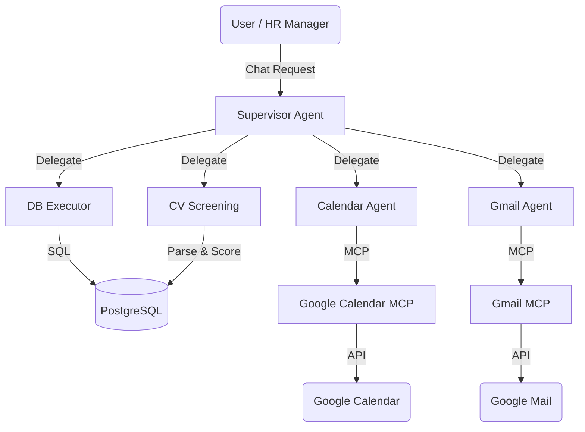

# Supervisor Agent - Implementation Details

## Architecture

The Supervisor Agent (`src/agents/supervisor/supervisor_v2.py`) uses a **LangGraph** orchestration model to manage the recruitment workflow. It maintains state for each interaction using a `MemorySaver` checkpointer, which allows it to remember context across multiple turns of conversation.

### Core Components

1.  **Agent Type**: OpenAI Functions Agent (powered by `gpt-4o`).
2.  **Orchestration Framework**: [LangGraph](https://github.com/langchain-ai/langgraph) for state management and tool execution.
3.  **State Persistence**: Uses `thread_id` to maintain conversation history per session.

### System Overview



## Tools & Sub-agents

The supervisor has access to the following tools, which it delegates tasks to:

1.  **`db_executor`**:
    *   **Purpose**: Querying the database for candidate information, status updates, and aggregations.
    *   **Capabilities**: SQL generation and execution (read-only by default, with specific write actions allowed).
2.  **`cv_screening_workflow`**:
    *   **Purpose**: Running the CV analysis pipeline.
    *   **Behavior**: Takes a candidate name, finds their CV, parses it, compares it against the job description, and saves the score/decision to the DB.
    *   **Sync/Async**: Currently synchronous wrapper around the workflow.
3.  **`gcalendar_agent`**:
    *   **Purpose**: Interacting with Google Calendar.
    *   **Backend**: Connects to a local Model Context Protocol (MCP) server (`src/mcp_servers/calendar-mcp`).
    *   **Capabilities**: List events, create events, check availability.
    *   **Execution**: Spawns a subprocess to run the MCP server.
4.  **`gmail_agent`**:
    *   **Purpose**: Interacting with Gmail.
    *   **Backend**: Connects to a local Model Context Protocol (MCP) server (`src/mcp_servers/gmail-mcp`).
    *   **Capabilities**: Send emails, read emails, search threads.
    *   **Execution**: Spawns a subprocess to run the MCP server.

## Development & Debugging

### Running the Supervisor UI

The supervisor is exposed via a Streamlit UI (`src/supervisor_ui/app.py`).

```bash
# Run with Docker (Recommended)
docker compose -f docker/docker-compose.yml up --build supervisor_ui
```

### Debugging with LangSmith UI

For deeper transparency and debugging of the agent's thought process, you can run it with LangSmith.

**Note:** You may need to temporarily disable `memory` (checkpointer) in `src/agents/supervisor/supervisor_v2.py` for the LangSmith UI to work correctly with this specific setup.

```bash
# 1. Start the database service
docker compose -f docker/docker-compose.yml up --build db

# 2. Run LangGraph dev server (pointing to local DB port)
POSTGRES_HOST=localhost POSTGRES_PORT=5433 langgraph dev
```

### Troubleshooting MCP Connections

If the supervisor fails to use Gmail or Calendar tools with errors like `Connection refused`, `Executable not found`, or `invalid_grant`:

#### 1. `invalid_grant: Token has been expired or revoked`

**Cause:**
The Google OAuth2 tokens (`token.json` or `calendar_token.json`) copied into the Docker container are invalid, expired, or were revoked. This happens if tokens are old or the environment changed.

**Solution:**
You must regenerate the tokens **locally** and then rebuild the container to copy the fresh tokens inside.

1.  **Delete old tokens locally:**
    ```bash
    rm secrets/gmail-mcp/token.json
    rm secrets/gcalendar-mcp/calendar_token.json
    ```
    *(Do NOT delete the `credentials.json` files!)*

2.  **Regenerate tokens:**
    Run the local test scripts. **A browser window will open asking you to log in and authorize the app.**
    
    *For Gmail:*
    ```bash
    python -m src.mcp_servers.examples.gmail.send_email
    ```
    
    *For Calendar:*
    ```bash
    python -m src.mcp_servers.examples.gcalendar.interact_calendar
    ```

3.  **Rebuild and Restart Container:**
    The `Dockerfile.supervisor` copies the `secrets/` folder at build time. You must rebuild to get the new files.
    ```bash
    docker compose -f docker/docker-compose.yml build supervisor_ui
    docker compose -f docker/docker-compose.yml up -d
    ```

#### 2. Other Issues
1.  **Check `uv` installation**: The MCP servers use `uv` to run. In Docker, this is installed at `/usr/local/bin/uv`.
2.  **Check Subprocess**: The supervisor spawns new processes for MCP servers. Ensure the container has enough memory.

