# 🧩 Candidate Database Schema

---

## 🗂 Overview

The **Candidate Database** manages all structured data related to applicants throughout the HR screening pipeline.  
It is designed to support both **deterministic queries** (e.g., “Top 10 CV scores”) and **LLM-based reasoning** (e.g., context summaries, evaluation traces).

The schema uses a **hybrid design**:
- **Relational** structure for core entities and relationships.
- **JSON fields** for flexible, semi-structured LLM outputs.

---

## 🧱 Entity Relationship Diagram

```mermaid
erDiagram

    CANDIDATES ||--o{ CV_SCREENING_RESULTS : "has many"
    CANDIDATES ||--o{ VOICE_SCREENING_RESULTS : "has many"
    CANDIDATES ||--o{ INTERVIEW_SCHEDULING : "has many"
    CANDIDATES ||--|| FINAL_DECISION : "has one"

    CANDIDATES {
        UUID id PK
        string full_name
        string email
        string phone_number
        string cv_file_path
        string parsed_cv_file_path
        enum status
        datetime created_at
        datetime updated_at
    }

    CV_SCREENING_RESULTS {
        UUID id PK
        UUID candidate_id FK
        string job_title
        float skills_match_score
        float experience_match_score
        float education_match_score
        float overall_fit_score
        text llm_feedback
        json reasoning_trace
        datetime timestamp
    }

    VOICE_SCREENING_RESULTS {
        UUID id PK
        UUID candidate_id FK
        string call_sid
        text transcript_text
        float sentiment_score
        float confidence_score
        float communication_score
        text llm_summary
        json llm_judgment_json
        string audio_url
        datetime timestamp
    }

    INTERVIEW_SCHEDULING {
        UUID id PK
        UUID candidate_id FK
        string calendar_event_id
        string event_summary
        datetime start_time
        datetime end_time
        enum status
        datetime timestamp
    }

    FINAL_DECISION {
        UUID id PK
        UUID candidate_id FK
        float overall_score
        enum decision
        text llm_rationale
        text human_notes
        datetime timestamp
    }
```



---

## 📋 Tables

### 1️⃣ `candidates`

Stores base applicant information and application metadata.

| Column | Type | Description |
|--------|------|--------------|
| `id` | UUID | Primary key |
| `full_name` | string | Candidate’s full name |
| `email` | string | Unique email address |
| `phone_number` | string | Contact number |
| `cv_file_path` | string | Path or cloud URL to the uploaded CV |
| `parsed_cv_file_path` | string | Path to parsed pdf file (stored as md) |
| `status` | enum | Candidate stage (`applied`, `cv_screened`, `voice_done`, etc.) |
| `created_at` | datetime | Application timestamp |
| `updated_at` | datetime | Last update timestamp |

---

### 2️⃣ `cv_screening_results`

Captures **CV screening metrics** and qualitative model feedback.

| Column | Type | Description |
|--------|------|--------------|
| `id` | UUID | Primary key |
| `candidate_id` | FK | Reference to `candidates.id` |
| `job_title` | string | Target role being screened for |
| `skills_match_score` | float | Match ratio for required skills |
| `experience_match_score` | float | Experience alignment score |
| `education_match_score` | float | Degree/education compatibility |
| `overall_fit_score` | float | Weighted total score |
| `llm_feedback` | text | Qualitative reasoning summary |
| `reasoning_trace` | JSON | Optional full LLM reasoning trace |
| `timestamp` | datetime | When evaluation was generated |

---

### 3️⃣ `voice_screening_results`

Contains results from automated voice interviews.

| Column | Type | Description |
|--------|------|--------------|
| `id` | UUID | Primary key |
| `candidate_id` | FK | Reference to `candidates.id` |
| `call_sid` | string | Twilio call identifier |
| `transcript_text` | text | Full transcript from Whisper/STT |
| `sentiment_score` | float | Tone or positivity measure |
| `confidence_score` | float | LLM-assessed confidence or clarity |
| `communication_score` | float | Fluency or articulation score |
| `llm_summary` | text | High-level summary of the voice screen |
| `llm_judgment_json` | JSON | Structured LLM evaluation (per-dimension) |
| `audio_url` | string | URL to stored audio recording |
| `timestamp` | datetime | Time of interview completion |

---

### 4️⃣ `interview_scheduling`

Tracks HR interview scheduling and status.

| Column | Type | Description |
|--------|------|--------------|
| `id` | UUID | Primary key |
| `candidate_id` | FK | Reference to `candidates.id` |
| `calendar_event_id` | string | Google Calendar event ID |
| `event_summary` | string | Event title |
| `start_time` | datetime | Interview start time |
| `end_time` | datetime | Interview end time |
| `status` | enum | Scheduling status (`scheduled`, `completed`, `cancelled`) |
| `timestamp` | datetime | Last updated timestamp |

---

### 5️⃣ `final_decision`

Stores the overall hiring outcome after all screening stages.

| Column | Type | Description |
|--------|------|--------------|
| `id` | UUID | Primary key |
| `candidate_id` | FK | Reference to `candidates.id` |
| `overall_score` | float | Aggregated weighted score |
| `decision` | enum | `hire`, `reject`, or `maybe` |
| `llm_rationale` | text | Model reasoning for decision |
| `human_notes` | text | HR reviewer comments |
| `timestamp` | datetime | Decision timestamp |

---

## 🧠 Design Principles

- **Hybrid Schema:** Structured relational tables for clean querying; JSON for flexible LLM outputs.  
- **Traceability:** All records timestamped and linked to a single candidate.  
- **Extensibility:** New screening stages (e.g., technical test results) can be added as new tables with `candidate_id` foreign key.  
- **Cascade Relationships:** Deleting a candidate removes all dependent results automatically.  
- **Explainability-Ready:** LLM reasoning traces preserved for audit and context replay.


---
# 🐳 Docker-Based Local Development Setup

---

 1️⃣ Clone and configure environment
```bash
cp .env.example .env
```
Your .env file should contain:
```bash
# Shared dev DB credentials
POSTGRES_USER=agentic_user
POSTGRES_PASSWORD=password123
POSTGRES_DB=agentic_hr
POSTGRES_HOST=db
POSTGRES_PORT=5432
```
2️⃣ Start the stack
```bash
docker compose up --build
```
This will:
- Spin up PostgreSQL in a container (agentic_hr_db)
- Build and run your app container
- Auto-initialize all database tables via SQLAlchemy

Expected logs:
```bash
🔌 Connecting to database at db:5432 ...
✅ Database initialized successfully.
```

3️⃣ Verify the setup
Connect to the running DB container:
```bash
docker exec -it agentic_hr_db psql -U agentic_user -d agentic_hr
```
Then check tables:

```sql
\dt
```
